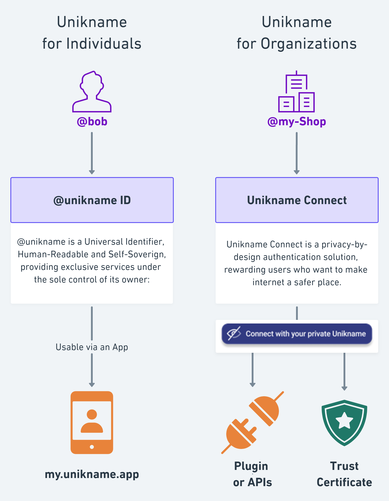
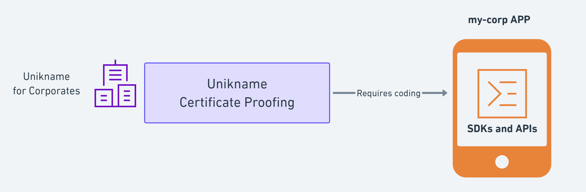

# What is Unikname&trade;?

Unikname&trade; is a European cyber-solution aiming of securing internet platforms and protecting user's privacy.

Unikname&trade; makes the internet safer and protect user's privacy thanks to Self-Sovereign Identifiers and blockchain technologies.

Unikname&trade; is intended for whose who wish to participates and contributes to make the internet more trustful. 

[[TOC]]

<hseparator/>

## @unikname ID: your Universal IDentifier

@unikname is a Universal Identifier, Human-Readable and Self-Soverign, providing exclusive services under the sole control of its owner.

@unikname owners can get and manage their @unikname, and control everything they can do a Self-Sovereign ID, like: 

* Private Sign-up
* Instant Login
* Secure access to confidential data
* Authentic data sharing
* Sign Documents
* Sharing proofs of authenticity
* Authenticate Operations
* Get rewards
* Redeem coupons
* ...

**@unikname ID is a Universal IDentifier:** it's a multi-purpose ID, it's always available and it's usable everywhere on the Internet.

**@unikname ID is Human-Readable:** it's easy to memorize it, like an eMail.

**@unikname ID is Self-Sovereign:** maybe the most important, it's under the sole control of its owner.

#### my.unikname.app

To get and use your own @unikname ID you need to install the ``My Unikname App``. Once you own your @unikname you can sign-up and log in to any website providing the ``Connect with Unikname`` button, and start being rewarded.

> _My.Unikname.App allows @unikname owners to control their digital life._

 

:zap: [Getting started with @unikname ID](/2-unikname-id)

<hseparator/>

## Unikname Connect: The next-generation authentication solution

Unikname Connect is a privacy-by-design authentication solution, rewarding users who want to make internet a safer place.

Unikname&trade; is an European next-generation authentication solution, passwordless, and working with a @unikname (a pseudo). Private-by-design and secured by the uns.network blockchain, it's a reliable alternate to former GAFAM social authentication solutions.

### Privacy-by-design

**User privacy comes first.** <brand name="UNC"/> is entirely built with the idea to keep user's connections private. Unikname does not collect any personal data (name, phone number, address, connection history...) at any time. The system will never use your @unikname identifier to trace your habits and behaviors on the Internet. 

Our technology makes it possible to customized user experience and services without collecting user data. Most of data are stored on user's smartphone and fully controlled by the user himself, and no one else. 

**<brand name="UNC"/> protects internet businesses from espionage**. User's connections are not traceable by third parties tracking tools. Only the user himself and the platform know their relationship.

### Unikname rewards its users

**Thanks to UNS Tokens,** Unikname users are encouraged to maximize use of their @unikname to log in any websites by rewarding them. Every unikname user who sign-up and login to a website receives rewards. These rewards are digital tokens called _UNS Tokens_. 

**Partner platforms using <brand name="UNC"/> offer promotional coupons for Unikname users.** UNS Tokens can be exchanged against vouchers or promotional coupons to be redeemed on any partner platforms.

### Simplest authentication

**<brand name="UNC"/> provides a disruptive UX User Experience** with no more password to remember, allowing instant login and frictionless sign-up to any websites. <brand name="UNC"/> simplifies day to day use of internet.

### Highly Secure

**2FA strong authentication:** <brand name="UNC"/> is a 2FA strong authentication solution by design, relying on a smartphone app and a PIN Code or biometric recognition. Technically <brand name="UNC"/> relies on latests oAuth and OpenID Connect authentication protocol standards. User accounts are more protected against hacks and data theft.

**Anti-Phishing:** Unikname Connect may inhibits phishing hack attempts of user’s access, protecting user's web account. There's no more userid and password to steal, and theft of authentication tokens has no value for a hacker. We adds a layer of cryptographic protection over the oAuth authentication protocol, in such a way that the authentication tokens can only be used only on a specific web domain name.(_Anti-Phishing feature requires a specific implementation_)

### New customer acquisition channel

**<brand name="UNC"/> becomes a new customer acquisition channel.** The large community of @unikname users receive incentive to explore websites using <brand name="UNC"/>. 

 

:zap: [Getting started with Unikname Connect](./3-unikname-connect)

<hseparator/>

## Unikname Certificate Proofing

Unikname Certificate Proofing is another solution aiming for securing mobile apps against falsified SSL X509 certificates and against man-in-the-middle attacks. This solution has been designe and developped with a bank company. 

<hseparator/>

## uns.network blockchain under the hood

Unikname&trade; solutions rely on the ([uns.network](https://www.uns.network/)) decentralized protocol and blockchain technology, secured by 23 delegates, elected by individual and organization stakeholders. This blockchain is specialized in providing dedicated services around Decentralized IDs and Self-Sovereign-Identity (SSID).

This uns.network blockchain is live, [up and running](https://explorer.uns.network/network-monitor) since May 2020. 
