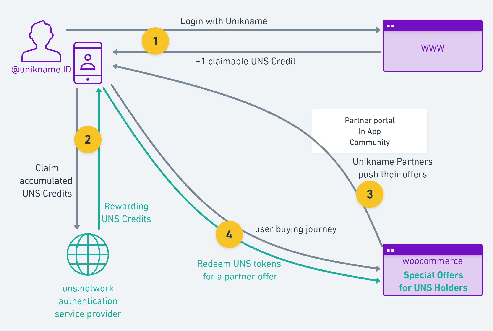

# What is the Unikname User Rewarding System?

Unikname rewards users who want to make internet a safer place thanks to the uns.network blockchain and its UNS token.

**Thanks to UNS Tokens,** Unikname users are encouraged to maximize use of their @unikname to log in to any websites by rewarding them. 

Every unikname user who sign-up and login to a website accumulate claimable credits (1). These credits are digital tokens called _UNS Tokens_. User claim his reward when he wants, and receives UNS tokens (2). Partner ecommerce website (eg. woocommerce...) using <brand name="UNC"/> propose special offers to Unikname users holding UNS tokens (3). During the payment process users can redeem some of their UNS tokens  for a partner offer (4). 

Unikname users can use their accumulated UNS tokens with any Unikname Partners. 

## eMerchants have full control of their marketing actions toward Unikname community

eMerchants using Unikname Connect create special offers on their dashboard and they decide : 
* the period of validity of every offers
* activate offers only for some users
* channels to push their offer: Partner Portal, Unikname Push In App, Unikname Newsletter...

## Rewards and redeems cannot be falsified 

Unikname Rewarding System is designed and based on the <brand name="uns"/> blockchain and the next-gen authentication protocol, ensuring that rewards and redeems of UNS tokens can not be counterfeit.

## The user privacy is secured

Our rewarding system ensure full user privacy. 

* no one can know which websites users have logged on to earn rewards*
* no one can know the ecommerce sites on which users have used their rewards*

_* nor even the Unikname team_
