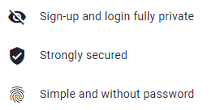

# UniknameID: your Universal ID

UniknameID is a Self-Sovereign Universal IDentifier, giving its owner total control over its digital life.

With your <unid/> and `My.Unikname.App` you can control your digital life: 
* sign-up and log in to any website that embeds the <brand name="unc"/> button, securely and privately
* share and get access to public information with your friends, authenticated and quickly
* earn network credits that you may redeem with a coupon, to be used with Unikname partners

<hpicture caption="Why to use your UniknameID to connect to websites?"></hpicture>

To get your own <unid/>, first you need to install the `My Unikname App`, then choose a unique name and root it into the global <brand name="uns"/>. 

<!-- 2021-01-14
Do not remove this DOT below (broken menu on left otherwise)
Ask for DLE or FAB for explanations
No time to fix it properly ...
 -->
.

## Getting Started

:zap: [How to install My Unikname App?](./howto-install-my-unikname-app)

:zap: [How to get my own UniknameID?](./howto-get-individual-unikname)

:zap: [How to connect to a website with my UniknameID?](./howto-connect)

:zap: [How to backup my UniknameID?](./howto-backup-my-unikname)

:zap: [How to restore my UniknameID?](./howto-restore-my-unikname)

:zap: How to become an ambassador? _coming soon..._

## Freemium and Premium 

:zap: [Can I get my UniknameID for free?](./can-i-get-uniknameid-for-free)

:zap: [Why do I have to pay for a short ID?](./why-to-pay-short-id)

:zap: [What are differences between FREEMIUM and PREMIUM UniknameID?](./what-are-differences-freemium-premium-unikname)

:zap: [How much does it cost to get a PREMIUM ID?](./howmuch-cost-uniknameid)

:zap: [How to get a FREEMIUM @unikname?](./howto-get-freemium-unikname)

:zap: [How to get a PREMIUM @unikname?](./howto-get-premium-unikname)

## Lifecycle

:zap: how my @unikname goes live? _coming soon..._

:zap: how to burn my @unikname? _coming soon..._

## Properties and Badges

:zap: How to manage my @unikname properties? _coming soon..._

:zap: How to get @unikname badges? _coming soon..._

## UNS tokens

:zap: [What is the User Rewarding System?](./../4-key-concepts/what-is-unikname-user-rewarding-system)

:zap: How to earn @unikname UNIK tokens? _coming soon..._

