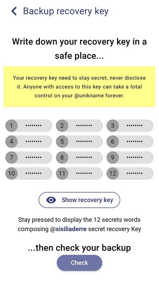

# How to backup my @unikname?

## Step 1. Backup your recovery key

Your UniknameIDentifier and all associated data (PIN code, recovery key) are strictly personal and confidential. We can't help you retrieve or restore it if you lose them or change your device. This is why **you must backup your recovery key immediately**. 

<hpicture></hpicture>

Your recovery key is composed of 12 secret words.

1. Tap **Secure now**.
2. Keep pressing **Show recovery key** and write down your recovery key in a safe place.
  
<hpicture caption="Recovery key backup"></hpicture>

3. Tap **Check** to test your recovery key backup.
4. Enter the secret words of your recovery key.

Your recovery key has been safely backed up!
