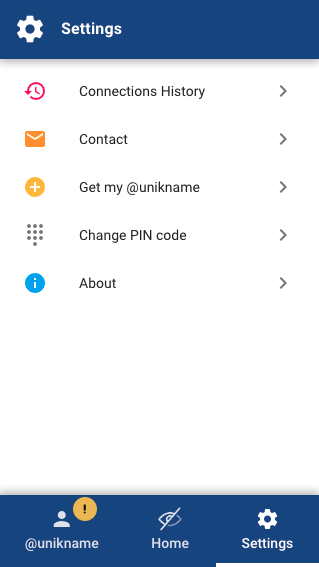
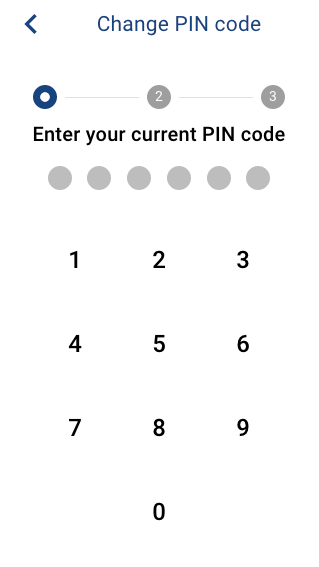
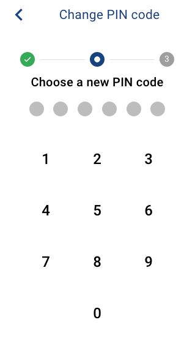
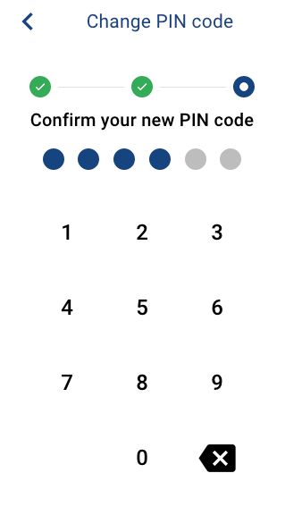
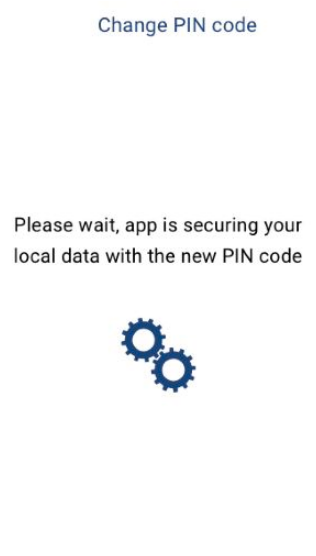
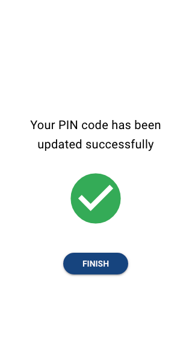

# How to change my app PIN code?

## Step 1. Go to settings

You can access PIN code update through

`Settings > "Change PIN code"`

<hpicture></hpicture>

## Step 2. Follow update process instructions

Process will:

1. first prompt you for your current PIN code.
2. then you'll be asked to choose a new PIN code
3. and finally to confirm it.

<hpicture></hpicture>
<hpicture></hpicture>
<hpicture></hpicture>

When all done, app will start to secure local data with the new PIN code.

This process must be very quick, but if not, please do not close the app.

<hpicture></hpicture>

At the end you should see the success screen. You're done now.

<hpicture></hpicture>

If it's the error screen don't panic, your old PIN code is still working.

## Step 3. Login with your new PIN code

After the success screen, every PIN code prompt will expect the new PIN code (including login screen after app restart).

On the next first login, if new PIN code doesn't work, you can try the old one to unlock the app. If so, the new PIN code will be forgotten. The old one will be the only valid PIN code of future prompts. You can still do a new update later.
