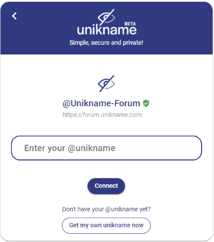

# How to connect to a website with your @unikname?

:::warning Prerequisite
:heavy_check_mark: You've already installed My Unikname App on your smartphone.
<hbox>_See [How to install my Unikname App?](./howto-install-my-unikname-app)_</hbox>
:heavy_check_mark: You've got your own @unikname Identifier.
<hbox>_See [How to get your @unikname?](./howto-get-individual-unikname)_</hbox>
:::

> Here we're going to demonstrate how to sign-up to our forum website. The process is the same on all partner websites that have integrated the Unikname Connect plugin.

## Your first Sign-up with your @unikname

Open a browser and go to [https://forum.unikname.com](https://forum.unikname.com), and click on `sign-up`.

<hpicture caption="Install example on a xaomi Red note8, with Chrome">
<video height="600" controls>
  <source src="./images/signup.mp4" type="video/mp4">
</video>
</hpicture>

## Login with your @unikname

If you already have an account on the website you want to login: 

<hpicture noshadow></hpicture>
1. click on the login button
1. enter your @unikname ID
1. open `my unikname App` on your smartphone
1. unlock the app with your PIN code or your fingerprint
1. click on validate the connection request
1. You're logged in!

<hpicture noshadow></hpicture>

## Troubleshooting

:::details After opening my unikname App on my smartphone, I don't see the connection request!?

:collision: **You took too long, comme back to the website and try again to connect.** Connection requests have a short lifetime, roughly one minute. If you open and unlock `my unikname app` after this time then the request won't appears. 

:collision: **Check your data connection on your smartphone.** Your smartphone must communicate to authentication servers, without network the request won't appears. 

:collision: **Check your @unikname spelling and try again.** If you enter a wrong @unikname then the request won't appears on your smartphone. 
:::

:::details I don't receive any notification on my smartphone!
:collision: **Open `my unikname App` and click on the connection request.** Even without notification you can confirm or reject connection requests by opening the App. You can check "notifications" are enabled into your settings.
:::
