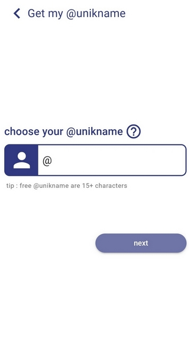

# How to get your own @unikname Identifier?

This guide explains how get your own @unikname Identifier with **My Unikname App** on your smartphone or tablet. 

[[toc]]

:::warning Prerequisite
:heavy_check_mark: You've already installed My Unikname App on your smartphone.
<hbox>_See [How to install my Unikname App?](./howto-install-my-unikname-app)_</hbox>
:::

<hseparator/>

## Create your personal @unikname identifier

:::tip
Choose your @unikname identifier carefully.

Your @unikname identifier is permanent and personal. Once it is created, you can't edit it or give it to another user.
:::

<hpicture caption="Defining your @unikname"></hpicture>

### Creating a short @unikname identifier, with a coupon 

If you have a coupon, you can create a "short" @unikname identifier, of 8-characters, or more. 

Short @unikname identifiers are protected by our Safetypo algorithm. It prevents other users to create identical or fraudulent @uniknames.

### Creating a free @unikname identifier

You can create a @unikname identifier for free, only if it is longer than 15 characters. 

If you wish to create a shorter @unikname identifier, contact us on [contact@unikname.com](mailto:contact@unikname.com)

**All done!** 

<hseparator/>

!!!include(.vuepress/md-templates/need-help.md)!!!

