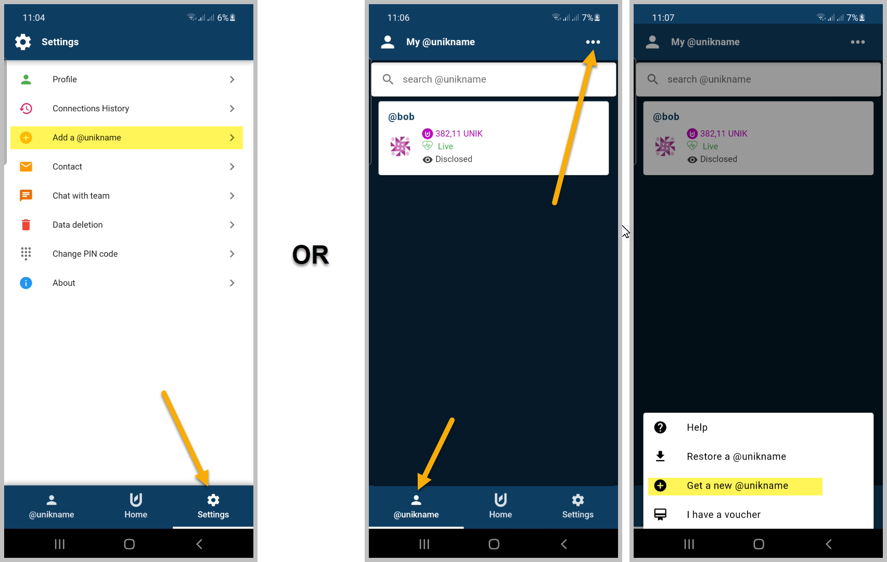

# How to get your own @unikname Identifier?

:::warning Prerequisite
:heavy_check_mark: You've already installed My Unikname App on your smartphone.
<hbox>_See [How to install my Unikname App?](./howto-install-my-unikname-app)_</hbox>
:::

If you've just installed `my unikname app` and entered you PIN code you should see the following screen asking you to get a new @unikname ID or to restore an existing one you already owned. 

<hpicture></hpicture>

:::details I've already setup a @unikname ID, how to get another one?
If you've already setup a <unid/> you've two ways to get a new one: 

1. Go to Settings / Get My @unikname
1. Go to @unikname / Get a new @unikname

:::

## Choose your personal @unikname ID

Your @unikname ID is unique, persistent, and personal. You can choose a pseudo, your real name, a nickname, or a funny one, it's up to you! Keep it simple as you may use it every day.

:::tip @unikname ID longer or equal to 15 characters are totally free!
:::

To get a scarce name, shorter than 15 chars, you can:
* use a PROMOTIONAL COUPON CODE.
* bought it with € or crypto
* exchange network credits ($UNS), if you own some

<hpicture></hpicture>

:::danger For readers of this help center we offer a PREMIUM 8 char length with the coupon code `UNIK8DOC2020`
:::

Choose your @unikname ID on the following screen:

<hpicture></hpicture>

:::warning
Once your @unikname ID has been created you won't be able to change it.   
You get it one time for all.
:::

If it's a 14 characters long or more then confirm to go to the last step. If it's a scarce one, a shorter than 15 characters, you can check its price within the price list, then confirm.

<hpicture noshadow caption="Exemple with @Marty.McFly-2015 and @Marty.McFly IDs"></hpicture>

## Create you @unikname ID one time for all

Once done you still have to create definitively your ID by rooting it in the global <brand name="uns"/>. It takes less than 10s.

<hpicture></hpicture>

:::tip privacy-by-design

Nobody else than you and the people with who you've decided to share it knows the <unid/> you've chosen. You may decide to disclose it publicly latter, but it will be your choice and under your sole control.
:::

**All done!** 

Next we're going to see how to use it to sign-up on a website and then to backup your ID. Let's go!
