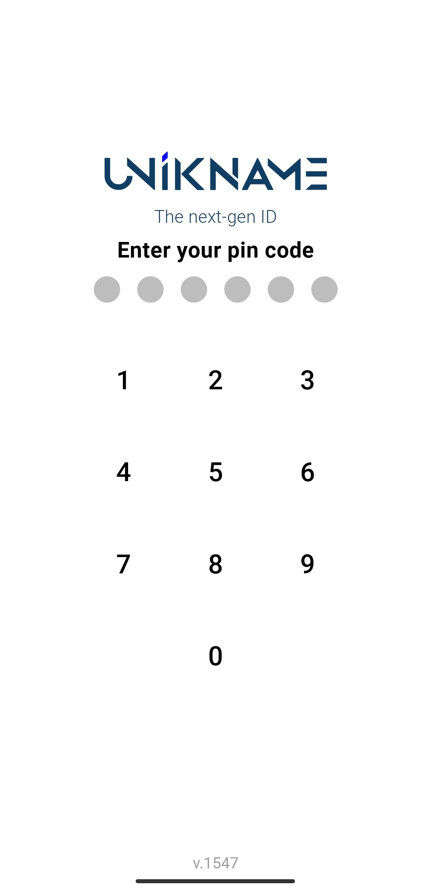

# How to install My Unikname App?

**My Unikname App** is required to get, manage and use <unid/> and network credits. It allows users to use their <unid/> to authenticate safely and privately to any websites. 

:::warning
Don’t try to download this application on traditional App stores, you won’t find it! **My Unikname App is a Progressive Web App (PWA)**: goodbye download and welcome simplicity of installation thanks to a QR Code or a clickable link.

[:mag_right: read our blog post to know more about PWA](https://www.unikname.com/en/2020/09/pwa-progressive-web-app-next-generation-applications/)
:::

Here we show you how to install this App. Let's go!

[[TOC]]

<hseparator/>

## Step 1. Go to https://my.unikname.app

Open your web browser on your smartphone and enter [my.unikname.app](https://my.unikname.app/).

<hpicture caption="Installing My Unikname App" noshadow></hpicture>

:::tip Browser Compatibility
**my.unikname.app** works on the most popular mobile browsers.
If you encounter issues with the installation, [check-out our compatibility matrix](./troubleshooting/my-unikname-installation-troubleshooting.html#which-browsers-is-the-my-unikname-application-compatible-with).
:::

:::details I met a compatibility issue screen, what can I do?
If you've met the following screen you can close it and you need to open another internet browser. 
<hpicture noshadow></hpicture>
If you're using an iPhone then open Safari, and if you're using an Android Smartphone then open Brave or Google Chrome. Then enter `my.unikname.app` again.
:::

## Step 2. Install Now!

When you click on `Install Now` your browser detects you're installing an App directly from an URL and is going to ask your confirmation.

<hpicture caption="Install example on a xaomi Red note8, with Chrome">
<video height="600" controls>
  <source src="./images/mun-installnow.mp4" type="video/mp4">
  <hpicture caption="Successful Install Page" ></hpicture>
</video>
</hpicture>

Then your App has been installed by your OS on the desktop of your Smartphone, like this:

<hpicture caption="My Unikname Icon between Brave and ProtonMail, on my Android" noshadow></hpicture>

:::tip Under the hood
On Android your smartphone has automatically "build" an App on your phone. This App is also available in the list of installed Apps like the ones coming from stores.
:::

:::details On my smartphone the App does not launch automatically like on the video, what can I do?
Go to your home screen, look for `my unikname app` icon and click to launch the App.
:::

:::details I did not see the "Add to home screen" message, what can I do?
You need to add it manually going to the menu of your internet browser:

:::

:::details I don't see the icon on my desktop, what can I do?
There's multiple possible reasons for that. 

You can try to add it manually going to the menu of your internet browser:

If it's still not working you can try to check your smartphone desktop settings. Some smartphone setting may prevent App install on the home screen.
:::

## Step 3. Run the App and create your PIN code

Now click on the App Icon on the Desktop like any other App. 

:::warning
Choose an easy to remember PIN Code, you'll need to enter this PIN code to unlock **My Unikname App**. There's no way to recover it!
:::

<hpicture caption="Defining a PIN code"></hpicture>

## Step 4. Setup main settings

App settings are limited, you're invited to enable notifications and to subscribe to the stay tuned newsletter. Both settings are optional.

<hpicture caption="App Main Settings" noshadow></hpicture>

:::tip Privacy-by-design
The stay tuned email is stored in a self-hosted, dedicated, and highly secure private server. This eMail is only required for private communication between you and the Unikname team. It is not shared with a third-party. 

Your eMail is not linked with your @unikname ID nor any other information.
:::

**All done!** 

You're now ready to get you own <unid/> or to restore one you already own.

## Troubleshooting

If you encounter issues when installing the application My Unikname, [see our troubleshooting section](/2-unikname-id/troubleshooting/my-unikname-installation-troubleshooting).
