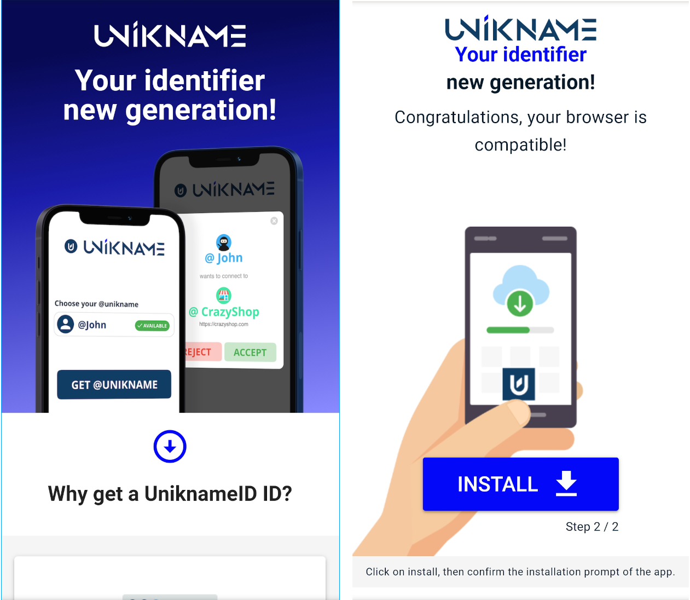
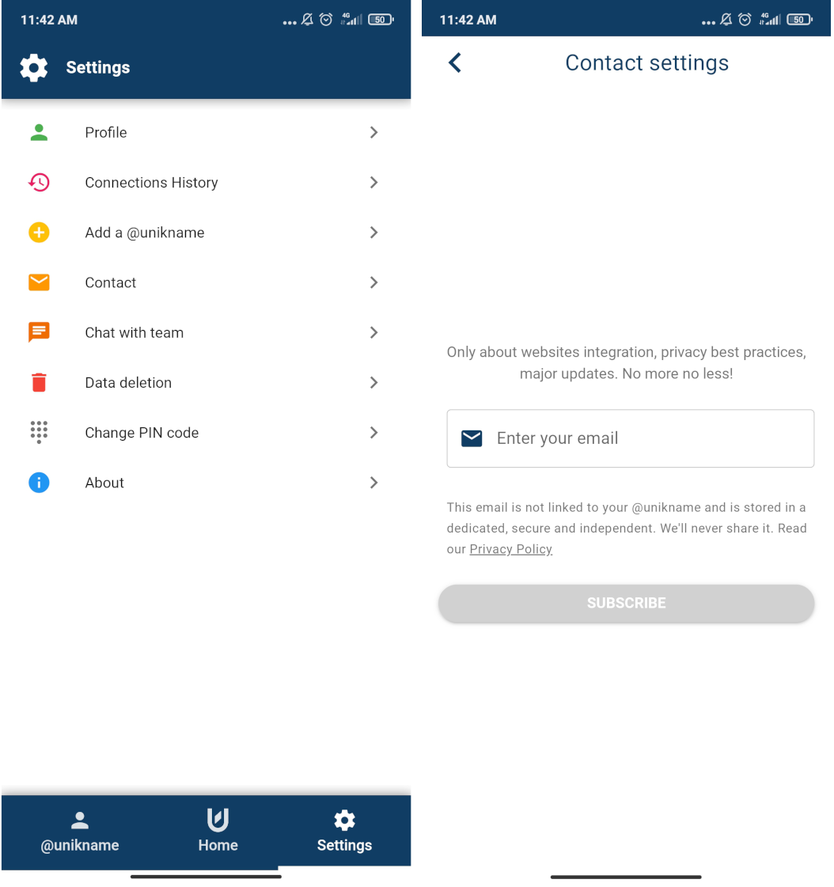

# How to install My Unikname App?

Unikname offers a decentralized robust authentication solution that is very easy to use, and ABOVE all fully respects users’ privacy. Its use is based on an application available on smartphones or tablets: we name it **My Unikname App**. 

**My Unikname App** allows @unikname owners to control their digital life. They can get and manage their @unikname SSID giving them total control over everything they can do with their ID, like private sign-up, login to websites, or validating operations such as paiements.

:::tip Under the hood
**My Unikname App** works like a cryptographic wallet. It embeds security features like handling pass phrase, handling private keys and calculating public addresses. So it is a safe place to manage your @unikname but also to manage your UNS tokens and to trigger transactions requiring tokens.
:::

But don’t try to download this application on traditional application stores (App Store for iOS, Google Play for Android); you won’t find it! **My Unikname App is a Progressive Web App (PWA)**, goodbye download, and welcome simplicity of installation thanks to the QR Code or a clickable link (your choice).

:::tip What is a Progessive Web App (PWA)?
If you want to know [more about PWA, read our blog post](https://medium.com/unik-name/en-progressive-web-app-pwa-the-next-generation-of-applications-36ff6592bd28)
:::

Here we show you how to install this next-gen App. Let's go!

**Table of content**

[[TOC]]

<hseparator/>

## Step 1. Go to my.unikname.app

Open your web browser on your smartphone and enter [my.unikname.app](https://my.unikname.app/).

<hpicture caption="Installing My Unikname App" noshadow></hpicture>

:::warning Browser Compatibility Issue
**my.unikname.app** works very well on : 

:heavy_check_mark: ``Brave`` on Android (our preferred choice)  
:heavy_check_mark: ``Google Chrome`` on Android   
:heavy_check_mark: ``Safari`` on Apple iOS.  

:x: ``Firefox`` does not manage PWA correctly for the time being.  
:x: ``Google Chrome on Apple iOS`` does not enable PWA yet
:x: ``Qwant`` mobile browser is not compatible with PWA yet
:::

## Step 2. Install Now! No download from any store!

Unless you met a browser compatibility issue you've been able to click on the "Install now!" button. After confirming the installation, you arrived to this page:

<hpicture caption="Successful Install Page" ></hpicture>

Then your App has been installed by your OS on the desktop of your Smartphone, like this:

<hpicture caption="My Unikname Icon between Brave and ProtonMail, on my Android" noshadow></hpicture>

:::tip Under the hood
On Android your smartphone has automatically "build" an App on your phone. This App is also available in the list of installed Apps like the ones coming from stores.
:::

## Step 3. Run the App and create your PIN code

Ok, now you've to click on the App Icon on the Desktop like any other App. Then define an easy to remember PIN Code.

You'll need to enter this PIN code to unlock **My Unikname App**.

<hpicture caption="Defining a PIN code"></hpicture>

## Step 4. Setup main App Settings

Before to finish you're invited to enable notifications and to subscribe to the stay tuned newsletter. Both settings are optional.

:::warning Confidentiality and privacy are on our core values
The stay tuned email is stored in a self-hosted, dedicated, and highly secure private server. This eMail is for our private communication between you and us only and is never shared with any third-party. 

Our App and our protocol ensure your **privacy-by-design**. That means:

- Nobody else than you knows your @unikname identifier, and the people with who you've decided to share it.
- Nobody from Unikname Team knows your @unikname.
- We're technically unable to link your e-mail address to your @unikname identifier, so we don't!
:::

<hpicture caption="App Main Settings" noshadow></hpicture>

**All done!** 

You're now ready to get you own @unikname or to restore one yoy already own.

