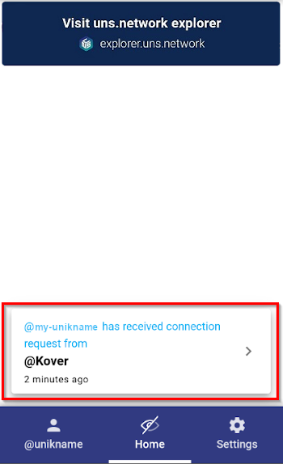

# How to log in to a Website With your @unikname?

[[toc]]

:::warning Prerequisite
:heavy_check_mark: You've already installed My Unikname App on your smartphone.
<hbox>_See [How to install my Unikname App?](./howto-install-my-unikname-app)_</hbox>
:heavy_check_mark: You've got your own @unikname Identifier.
<hbox>_See [How to get your @unikname?](./howto-get-individual-unikname)_</hbox>
:::

<hseparator/>

If you already have an account on the website you want to login to, just click on the <brand name="UNC"/> button.
You're logged in!

**If you don't have an account on a website, you have to:** 

 1. Tap the <brand name="UNC"/> button.
 
 <hpicture caption="First-time sign-up on kover.link website"></hpicture>

2. Enter your @unikname, as requested.

<hpicture></hpicture>

3. On the Unikname App, accept the connection request.

<hpicture></hpicture>

4. Enter your PIN code, as requested. 

<hpicture></hpicture>

**You're logged in!**

<hpicture></hpicture>

**All done!** 

<hseparator/>

!!!include(.vuepress/md-templates/need-help.md)!!!

