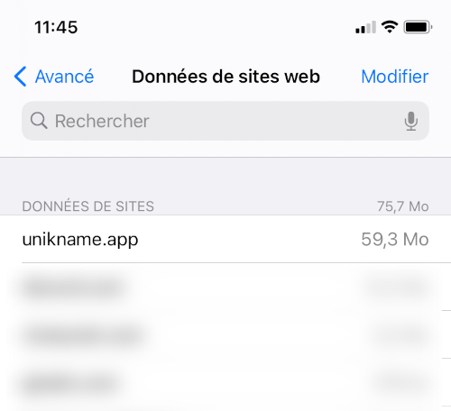

# How to reset My Unikname App?

**Table of Content**
[[TOC]]

## Why reset?

- You have lost your PIN code
- Your application is corrupted
- You want to erase all data of My Unikname App

### Caution

:::danger Deletion of very important data

Resetting My Unikname App **WILL DESTROY ANYTHING in your application**.

You will lose:

👉 Your @unikname

👉 UNS credits

👉 Therefore the accounts on the websites where you logged in with your @unikname

👉 The history of your connections
:::

[If you have backed up your @unikname](../howto-backup-my-unikname.html), you will be able [to restore them]((../howto-restore-my-unikname.html)).

**So be sure of what you want to do!**

## On Apple iOS

- Go to `Settings` > `Safari` > `Advanced` > `Sites data`

<hpicture caption="Menu where to reset My Unikname App"></hpicture>

- Search in the list: `unikname.app`
- Swipe the item left
- Click "Delete"

All data of My Unikname App has been destroy.

You can now [set up My Unikname again](../howto-install-my-unikname-app.html#step-2-install-now) and [restore your @unikname](../howto-restore-my-unikname.html).
