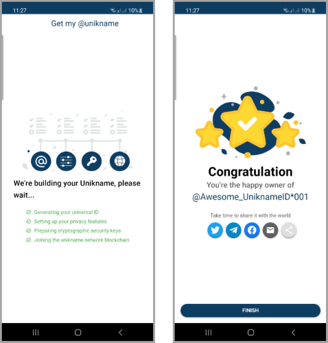

# How to use a pre-paid VOUCHER and a promotional COUPON code to get a UniknameID?

:::warning Prerequisite
:heavy_check_mark: You've already installed My Unikname App on your smartphone.
<hbox>_See [How to install my Unikname App?](./howto-install-my-unikname-app)_</hbox>

:heavy_check_mark: You've a pre-paid voucher code.
<hbox>_See [How to get a premium UniknameID?](./howto-get-premium-unikname)_</hbox>

:::

Pre-paid Voucher allows you to get a [PREMIUM UniknameID](what-are-differences-freemium-premium-unikname) without having to make a buying transaction within the App, and Promotional COUPON code allows you to get a PREMIUM UniknameID for free.

The ways to get your own <unid/> are the same either with a pre-paid VOUCHER code or a promotional COUPON code. 

* [1st way: enter you VOUCHER code or COUPON code first](#_1st-way-enter-you-voucher-code-or-promotional-code-first)
* [2nd way: choose your UniknameID first](#_2nd-way-choose-your-uniknameid-first)

## 1st way: enter you VOUCHER code or PROMOTIONAL code first

Go to `Settings/Add a UniknameID`. 

<hpicture></hpicture>

_NOTA: If you've just installed `my unikname app` and entered you PIN code then you're direcly in._

<hpicture></hpicture>

Select `I have a voucher`, then enter your VOUCHER code or your promotional COUPON code and confirm.

:::tip 
The VOUCHER code and COUPON code are case insensitive.

:::

<hpicture></hpicture>

:::warning 
VOUCHER code and COUPON code can be used a limited number of time, usually 1 unless otherwise specified. 
:::

Then you've to choose your personal <unid/>, matching your VOUCHER specifications or your COUPON specifications : 

| Specification | |
|-|-|
|Alphabet| Your voucher or your coupon specifies the allowed alphabet, e.g. Latin|
|Length| Your voucher or your coupon specifies a minimum length e.g.   Regular 10+ Latin Characters, Short 7+ Latin Characters, Rare 4+ Latin Characters, Tiny 3+ Latin Characters
|Pre-reserved UniknameID| Your voucher may also specifies a pre-reserved UniknameID.

_NOTICE: You can find the specifications of you voucher code where you get it, for exemple in the order confirmation email._

Your UniknameID is unique, persistent, and personal. You can choose a pseudo, your real name, a nickname, or a funny one, it's up to you! Keep it simple as you may use it every day.

:::warning
Once your UniknameID has been created you won't be able to change it. You get it one time for all. 

:::

Choose your UniknameID on the following screen:

<hpicture></hpicture>

Once done you still have to create definitively your ID by rooting it in the global unikname.network. It takes less than 10s.

<hpicture></hpicture>

All done.

:::tip Privacy-by-design

Nobody else than you and the people with who you've decided to share it knows the <unid/> you've chosen. You may decide to disclose it publicly latter, but it will be your choice and under your sole control.
:::

---

## 2nd way: choose your UniknameID first

Go to `Settings/Add a UniknameID`. 

<hpicture></hpicture>

_NOTA: If you've just installed `my unikname app` and entered you PIN code then you're direcly in._

<hpicture></hpicture>

Then you've to choose your personal <unid/>, matching your VOUCHER specifications or your COUPON specifications : 

| Specification | |
|-|-|
|Alphabet| Your voucher or your coupon specifies the allowed alphabet, e.g. Latin|
|Length| Your voucher or your coupon specifies a minimum length e.g.   Regular 10+ Latin Characters, Short 7+ Latin Characters, Rare 4+ Latin Characters, Tiny 3+ Latin Characters
|Pre-reserved UniknameID| Your voucher may also specifies a pre-reserved UniknameID.

_NOTICE: You can find the specifications of you voucher code where you get it, for exemple in the order confirmation email._

Your UniknameID is unique, persistent, and personal. You can choose a pseudo, your real name, a nickname, or a funny one, it's up to you! Keep it simple as you may use it every day.

:::warning
Once your UniknameID has been created you won't be able to change it. You get it one time for all.
:::

Choose your UniknameID on the following screen, then confirm:

<hpicture></hpicture>

Then on the payment screen, choose `I have a coupon`:

<hpicture></hpicture>

then enter your VOUCHER or COUPON code and validate. If your code is valid and if the choosen UniknameID match its rules, then you are ok to create it!

:::tip 
The voucher and coupon code are case insensitive.

:::

<hpicture></hpicture>

Once done you still have to create definitively your ID by rooting it in the global unikname.network. It takes less than 10s.

<hpicture></hpicture>

All done.

:::tip Privacy-by-design

Nobody else than you and the people with who you've decided to share it knows the <unid/> you've chosen. You may decide to disclose it publicly latter, but it will be your choice and under your sole control.
:::

