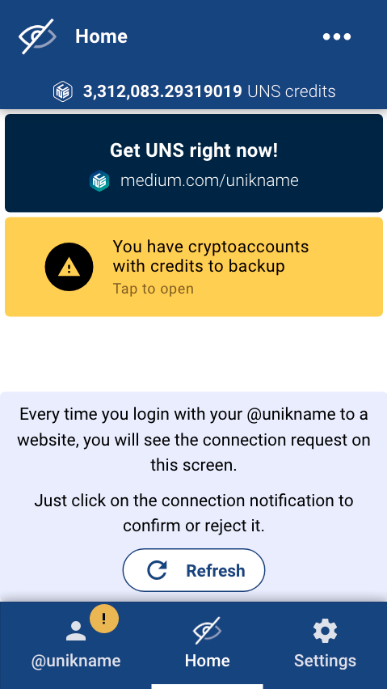
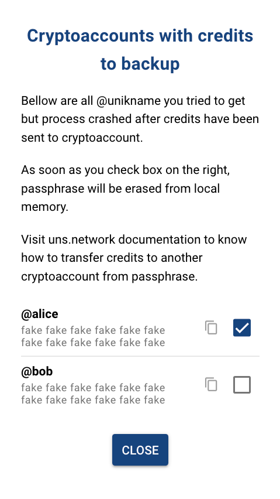
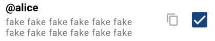

# My Unikname Payment Troubleshooting

**Table Of Content**

[[TOC]]

## Buying @unikname with UNS tokens in My Unikname App

### How to recover your UNS tokens when the mint of @unikname has failed?

You should have the following warning banner on home page :

<hpicture ></hpicture>

Tap to open the recovery page :

<hpicture ></hpicture>

All @unikname with failed mint are listed.

For each @unikname you have :

<hpicture ></hpicture>

- explicit value used
- twelve words passphrase
- a passphrase clipboard copy button
- a checkbox

When you've backuped the passphrase to a safe place, check the box.

When you close the page (bottom button), each checked passphrase will be erased from local storage.

Warning banner disappears when there is no passphrase left to backup.
