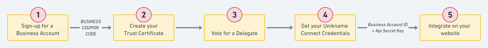

# Getting started with Unikname Connect

Integrating <brand name="UNC"/> onto your website is quite simple. It's a five step process taking between a few minutes and several hours depending on your website technology. 

We guide you through the process to make it simple. Let's go 👉

## Prerequisites

Before to start you need to install the CLI and to get your personal @unikname.

:zap: [Install the CLI?](./howto-install-uns-cli)  
<hbox>The <brand name="uns"/> Command Line Interface (the CLI) is required to set-up your Unikname-Connect account.</hbox>

:zap: [Get your personal @unikname with the CLI?](./howto-get-my-unikname-via-cli)
<hbox>We show you how to create your @unikname with the CLI and how to restore it into the App.  
_:warning: This step is not required if you already have your @unikname._</hbox>

## Setup your Unikname-Connect account

:zap: [1. Sign-up for a Unikname-Connect account?](./howto-signup-business-account)
<hbox>Sign-up and get the Business Coupon Code required to create the trust certificate for your organization.</hbox>

:zap: [2. Get the trust certificate for your website, and to setup it?](./howto-create-unikname-trust-certificate-organization)
<hbox>This certificate is used by the <brand name="UNC"/> authentication protocol.</hbox>

:zap: [3. Vote for your delegate?](./howto-vote-for-delegate-organization)
<hbox>Unikname Connect is based on a decentralized network secured by 23 delegates. You need to vote for one.</hbox>

:zap: [4. Get your Unikname Connect Credentials?](./howto-get-unikname-connect-credentials)
<hbox>These credentials are used to setup your website.</hbox>

## Install Unikname-Connect on your website

For this installation, the process depends on your website:

| <!-- -->    | <!-- -->    | <!-- -->    |
|:-------------:|:-------------:|:-------------:|
| [![][auth0-logo]](integration-technology/auth0/)       | [![][discourse-logo]](integration-technology/discourse/)        | [![][nodejs-logo]](integration-technology/nodejs/) |
| [![][wordpress-logo]](integration-technology/wordpress/) | [![][woocommerce-logo]](integration-technology/woocommerce/) | [![][oauth2.0-oidc-logo]](integration-technology/oauth2.0-openidconnect/) | 

[auth0-logo]: ./integration-technology/auth0/auth0-logo.png "Unikname Connect for Auth0"
[discourse-logo]: ./integration-technology/discourse/discourse-logo.png "Unikname Connect for Discourse"
[nodejs-logo]: ./integration-technology/nodejs/nodejs-logo.png "Unikname Connect for Node JS"
[wordpress-logo]: ./integration-technology/wordpress/wordpress-logo.png "Unikname Connect for Worpress"
[woocommerce-logo]: ./integration-technology/woocommerce/woocommerce-logo.png "Unikname Connect for WooCommerce"
[oauth2.0-oidc-logo]: ./integration-technology/oauth2.0-openidconnect/oauth2.0-openidconnect-logo.png "Unikname Connect for any OAuth 2.0 or OpenID Connect solution"

<hbox>

|[nodejs SDK](./integration-technology/nodejs) | your website has been developed with **nodejs programing langage**, few lines of code need to be added. |
|-|-|
|[Auth0](./integration-technology/auth0) | your website already embed **Auth0 Authentication services**, e.g. Social Authent, a simple setup is required. |
|[Discourse Forum](./integration-technology/discourse) | you want to install to a **Discourse Forum**, install and setup our plugin |
|[WordPress](./integration-technology/wordpress) | you want to install to a **Wordpress website**, install and setup our WP plugin |
|[WooCommerce](./integration-technology/woocommerce) | you want to install to a **WooCommerce website**, install and setup our WP plugin |
|[Matomo](./integration-technology/matomo) | you want sign-in to your **Matomo account** with your @unikname, install and setup the OIDC plugin |
|[Any other website](./integration-technology/oauth2.0-openidconnect) | for any website you can **call our APIs** compatible with OAuth2.0 and OpendID Connect standard protocol. |
  
</hbox>

<hseparator/>

## ...to go further

Then if you've joined the APOLLO Partnership program you will see incoming traffic as soon as the partnership tag is taken into account on your website. Finally you may want to Participate in securing the network and to operate a node. 

:zap: [Join the partnership program](./howto-join-the-partnership-program)  
:zap: [Participate in securing the network](./howto-participate-in-securing-the-network)

