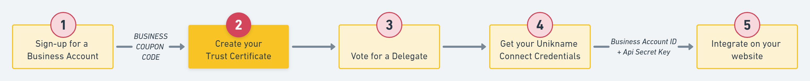
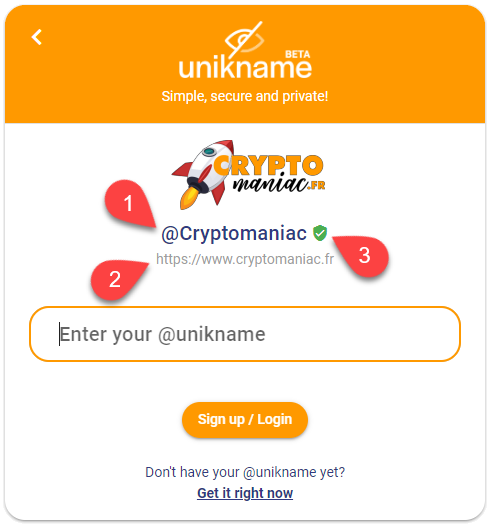
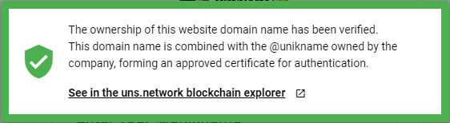

::: warning
UNS/uns.network/universal-name-system is the old name of unikname.network blockchain.
UNIK is the old name of UNIKNAME nft token
UNS is the old name of UNIK protocol token
Urls and old documentation are not renamed yet but are still valid. We're updating progressively.
:::
# How to create and setup the Unikname Trust Certificate for your website?



You've already discovered @unikname ID for individual where the main purpose is to allow people to keep full control of their Digital Identity and to keep their web authentications fully private. There's another type of @unikname ID dedicated for organization.

**@unikname IDs of type Organization** are disclosed publicly and they're used by the <brand name="UNC"/> authentication protocol. Combined with the domain name of your website it offers a strong cyber-protection for your user account. The @unikname ID of type organization can only be created with a `UNIKNAME-CONNECT COUPON CODE` obtained after human verification and with the Command Line Interface tool (the CLI).

Here we explain how to create a @unikname of type Organization, how to disclose it publicly, and how to link it with your website domain name and to make it your trust certificate.

:::warning Prerequisites
:heavy_check_mark: You've already installed the Command Line Interface tool on your desktop.  
<hbox>_See [How to install the CLI?](./howto-install-uns-cli)_</hbox>
:heavy_check_mark: Unikname Team has provided you your **`UNIKNAME-CONNECT COUPON CODE`** (step 1)
<hbox>_See [How to sign-up for a Unikname-Connect Account?](./howto-signup-unconnect-account)_</hbox>
:::

<div id="trust-appearance">&nbsp;<br/></div>

:::tip Where does your trust certificate information appear?

Your users see your trust certificate information when they sign-up and login to your website.

<hpicture noshadow caption="Example of Trust Certificate Information on Cryptomaniac Website - Click to see it live">[](https://www.cryptomaniac.fr/?OIDCCallback=UniknameConnect)</hpicture>

1. The @unikname ID of type organization. **Usually your brand**.
1. The verified domain name where Unikname Connect is installed.
1. The green shield, a button which allows users to check the validity of this information.

    **It proves the ownership of the domain by you**.

<hpicture noshadow caption="Trust Certificate Link"></hpicture>

4. The logo of your organization

:::


**Table of Content**

[[TOC]]

<hseparator/>

## Step 1. Create a new cryptoaccount

First you need to create a cryptoaccount with the CLI. **This one will be the cryptoaccount of your organization**, not your own.

You should've already done it for your individual @unikname, so the process is the same.

**DO NOT USE THE SAME CRYPTOACCOUNT** as for your other individual @unikname.

:::tip What is a Crypto Account?
A crypto Account is a digital account maintained in a highly secure way by a decentralized network, a blockchain, in which all transactions between you and others are recorded.
It is safer than a bank account. 
:::

Open your terminal on your desktop and enter the following command: 
```bash 
uns cryptoaccount:create
```

The cryptoaccount is immediately generated. It has two unique public numbers called the **address** and the **publickey**, and is protected by two private secrets, the **privateKey** and the **passphrase**. 

Here is an example of what you see on your screen:
```bash{8}
» :warn: Backup your cryptoaccount information in a secure place.
{
  "address": "UgMrbSEAVf6b2jnJbqzDbtmVkY3ziqpWAx",
  "publicKey": "03f2abc19eedadr693b04bf5656a7b809003d359eed883494991d81f23d5a3985",
  "privateKey": "4ba4cb8619f538c610f8092251b83fhfd647e4cece0e26blfbb6b3aef15756c",
  "passphrase": "artwork impulse lorem bounce solution naive ghost lottery stone club goat target",
  "network": "livenet"
}
```
> NOTA: these values are **samples** (more, they are invalid 😉), **don't use them for you**

Then make an immediate backup of these information in a safe place.

The most important part of them is the `passphrase`, also known as "secret recovery code".

## Step 2. Create the @unikname ID for your organization

Okay, now you can create the @unikname ID for your organization, using your UNIKNAME-CONNECT COUPON CODE (see prerequisites here above) and using the information of the just created cryptoaccount.

The @unikname ID for your organization must follow these rules:
- containing at least one letter and be longer than 6 characters
- being very close to your domain name but without the `.com` and without any other extension

Your @unikname is case, accent and separator insensitive like individual ones.
That means if you choose `my-saas-platform-101` then you're protected against squatting with `mySaaS_platform101` or `mysaasplatform*101`

:::warning
Choose your organization @unikname identifier wisely.

Keep in mind that once created this @unikname identifier will be permanently associated to your organization and disclosed to the other users. 
:::

Enter the following command replacing `my-saas-platform-101` by your own identifier, and replacing `MY-UNIKNAME-CONNECT-COUPON` by the one you've obtained when you sign up.

```bash
uns unik:create --type=organization --explicitValue="my-saas-platform-101" --coupon="MY-UNIKNAME-CONNECT-COUPON"
```

The CLI ask you for the **passphrase** of your cryptoaccount.

**DO NOT GENERATE YOUR OWN PASSPHRASE**, you must use the one you've generated [in the previous section](#step-1-create-a-new-cryptoaccount).

Then the result should look like this:
```bash
{
  "data": {
    "id": "f6018b8dcddbc9f8675577419c3493ffbc961876062655be43fce108e52408c0",
    "transaction": "f9718b85d6f88306e9eb3af4aa686897b8443e19251684976a6874c7f06a8378",
    "confirmations": 1
  }
}
```
> NOTA: The `id` is the unique technical ID of the @unikname created. This `id` is recorder in the blockchain and can be queried with the <brand name="uns"/> blockchain explorer ([example for the @unikname `@organization:unikname`](https://explorer.unikname.network/uniks/f6018b8dcddbc9f8675577419c3493ffbc961876062655be43fce108e52408c0)).

Ok, now it's a good time to backup all these highly sensitive information in a safe place: 

:::danger Save sensitive information
It is very important to save your sensitive information at this stage! **There's no way to recover them** nor to look for it later.

**So do it right now!**

👉 The cryptoaccount of your company: `address`, `publicKey`, `privateKey`, `passphrase`

👉 Take care of spelling the 12 words of the passphrase. You should be able to access it for all your company-life long.

👉 The @unikname you've chosen, mentioning it's type: "organization", and its `id`
Your @unikname is obfuscated within the blockchain so that means **nobody knows it unless you**.

👉 You should use a password safe solution like [_Lastpass_, _Keepass_ (or others)](https://alternativeto.net/category/security/password-manager/), so you're encouraged to save your information in it.
:::

## Step 3. Disclose the @unikname ID of your organization

Unikname of type Organization must be publicly disclosed in order to be used with <brand name="UNC"/> on your website. By default all @unikname values are obfuscated and publicly hidden. 

Run the following command to disclose the @unikname of your organization:

```bash
uns unik:disclose "@organization:my-saas-platform-101" -e "my-saas-platform-101"
```

> Replace `my-saas-platform-101` by the @unikname of type organization you want to disclose. You need to change it at both places. For more informations about the Disclose command, see the [unikname.network documentation](https://docs.unikname.network/uns-use-the-network/cli.html#unik-disclose).

## Step 4. Prove the ownership of your website

::: tip Dedicated documentation

Please note that we also have dedicated documentations to add the verification package to your website for:
- [WordPress/WooCommerce websites](/6-wp-wordpress/howto-verify-url-domain.html)

:::

At this step you're going to prove the ownership of your website and to link it to the @unikname of your Organization.

Unikname of type Organization must be linked with your web domain name in order to be used with <brand name="UNC"/> on your website.
In concrete terms, this consists of generating a `Verification Key` from your @unikname and to publish it to your website.

This publication can be done in two ways depending on your credentials: either by modifying the `<head>` section of your html page, either by publishing a hidden text page directly at the URL of your website.

::: tip Why is it so important to prove the ownership of my website?

Proving the ownership of your website is matter of trust.

Please, [read the explanations above in this current documentation for more information](#trust-appearance).

:::

### Generate the verification package

First of all enter the following command to generate the verification package, using the [`properties:register` CLI command](https://docs.unikname.network/uns-use-the-network/cli.html#properties-register):

```bash
uns properties:register "@organization:my-saas-platform-101" --value "www.my-saas-platform-101.com" 
```
> Replace `my-saas-platform-101` by your @unikname of type Organization and `www.my-saas-platform-101.com` by the URL of your own website.

::: warning HTTP protocol
Do not include the `https://` protocol string in front of your domain name.
It is added by default by the command.
:::

The command generates two proofs, to be used later:

- An output in the console, with the **`verificationKey`**:
```json{6}
{
  "data": {
    "type": "url",
    "value": "www.my-saas-platform-101.com",
    "filename": "uns-verification.txt",
    "verificationKey": "fi5TrRlrW1Dx1jEGCCEXISVKuNSIk2GOzD75MLmv58MImSNDM180HPDXyvF383jYj5ki-TSMrxMDiQ-pplpJxQ",
    "expirationDate": "2020-08-15T12:39:31.000Z"
  }
}
```

- a file named `uns-verification.txt` in the current directory, the **_verification package_**

You will next add **one of** these proofs to the website you want to verify the URL.

### Add the verification package to your website

There are several ways to add the verification package to your website:

* Either [add an HTML <meta> tag to your website](#add-an-html-tag-to-your-website), with the **`verificationKey`**
* Or [upload a text file to your website](#upload-a-text-file-to-your-website) with the **_verification package_**

#### Add an HTML <meta> tag to your website

Add a `<meta...>` tag to the HTML code of the home page of your website, located at `https://www.my-saas-platform-101.com`. 

In the `<head>` section, like this:

```html{6}
<html>
  <head>
    <title>Page Title</title>
    ...
    <!-- this is the line to add below -->
    <meta name="uns-url-checker-verification" content="your_verification_Key">
    ...
  </head>
<body>
...
```
> Replace **`your_verification_Key`** with the **`verificationKey`** that has been previously generated with the `uns properties:register` command.

::: tip The verificationKey format

The **`verificationKey`** is a 86-length characters and digits, such as `fi5TrRlrW1Dx1jEGCCEXISVKuNSIk2GOzD75MLmv58MImSNDM180HPDXyvF383jYj5ki-TSMrxMDiQ-pplpJxQ`.

**⚠ Do not used** the content of the verification package file `uns-verification.txt` here.
:::

Until done, finish the process by executing the [`properties:verify` CLI command](https://docs.unikname.network/uns-use-the-network/cli.html#properties-verify):

```bash
uns properties:verify "@organization:my-saas-platform-101" --url-channel html
```

> Replace `my-saas-platform-101` by your @unikname of type Organization.

The command will tell with you it is a success or will display an error message you can try to solve by yourself by [reading the section below](#what-to-do-when-it-doesn-t-work).

Then, a unikname.network **URL_Checker** service provider will crawl your website, within 72 hours, to check the verification package.

::: tip When to remove the proof from the web page
Keep the HTML tag into the webpage as long as possible.
An **URL_Checker** service may need **up to 72 hours** to check your website. Removing this HTML tag too soon from your site will cause the verification to fail.

It is also safe to leave it forever 😉
:::

If everything is ok, you can now [go to the last step of this guide](#step-5-check-your-setup).

##### What to do when it doesn't work?

::: details Potential errors

The following verification errors can occur with HTML tag verification:

- Meta tag not found/in the wrong location

  The verification meta tag must be within the `<head>` section of the page.
  If you see errors, check the following:

  - Is the meta tag on the correct page?

      The URL Checker looks for it on the site's home page.
      This is the page that the web server returns when someone requests the site (such as `http://www.mycompany.com/`).
      This page is often named `index.html` or `index.htm`, but could be named differently, depending on your server's configuration.
  
  - Is the meta tag in the correct place on the page?

    The URL Checker looks for it in the page's `<head>` section. An example of correct placement is shown here:

    ```html
    <html>
      <head>
        <title>Page title</title>
        ...
        <meta name="uns-url-checker-verification" content="verificationKey">
        ...
      </head>
    <body>
    ...
    ```

    If you're using a web editor or a WYSIWYG editor to edit your page, make sure to select the 'Edit HTML' option or to edit the source code of the page.

- The meta tag is incorrect

  The URL Checker found the verification meta tag, but the content was incorrect.
  To avoid errors, copy and paste the `verificationKey` value provided by the [`properties:register`](#properties-register) command.

- More [common verification problems](#common-verification-errors) are listed below.

:::

#### Upload a text file to your website

Upload the **verification package** file `uns-verification.txt` that has been previously generated with the `uns properties:register` command to the subdirectory **`.well-known` of the root folder of your website**.

The **URL_Checker** service will verify the file by reaching the following URL:

    https://www.my-saas-platform-101.com/.well-known/uns-verification.txt

::: tip The verification package file

The **verification package** is a file named `uns-verification.txt`, which contains a very long string which begins with `eyJ0e`.

**⚠ Do not used** the `verificationKey` here.
:::

Until done, finish the process by executing the [`properties:verify` CLI command](https://docs.unikname.network/uns-use-the-network/cli.html#properties-verify):

```bash
uns properties:verify "@organization:my-saas-platform-101" --url-channel file
```

> Replace `my-saas-platform-101` by your @unikname of type Organization.

The command will tell with you it is a success or will display an error message you can try to solve by yourself by [reading the section below](#what-to-do-when-it-doesn-t-work-2).

Then, a unikname.network **URL_Checker** service provider will crawl your website, within 72 hours, to check the verification package.

::: tip When to remove the proof from the web page
Keep the HTML tag into the web page as long as possible.
An **URL_Checker** service may need **up to 72 hours** to check your website. Removing this HTML tag too soon from your site will cause the verification to fail.

It is also safe to leave it forever 😉
:::

If everything is ok, you can now [go to the last step of this guide](#step-5-check-your-setup).

##### What to do when it doesn't work?

::: details Potential errors

The following verification errors can occur with uploading a text file verification:

- Verification file not found

  Please check where the `uns-verification.txt` file was uploaded.
  It must be reached at `https://www.my-saas-platform-101.com/.well-known/uns-verification.txt` location without any modifications.
  If the file name or content does not match the `uns-verification.txt` file provided, the unikname.network **URL_Checker** service provider won't be able to verify your site ownership.

- Your verification file has the wrong content

  The unikname.network **URL_Checker** service provider checks to see if your verification file has the same filename and content as the file provided by the CLI command.
  If the file name or content does not match the `uns-verification.txt` file provided, the unikname.network **URL_Checker** service provider won't be able to verify your site ownership.
  Please, upload the `uns-verification.txt` file provided to the specified location without any modifications.

- Hacked verification file

  Your verification attempt failed in a way that indicates that your site might have been hacked.
  [Learn more about detecting and fixing hacked sites](https://developers.google.com/web/fundamentals/security/hacked/).

- Your verification file redirects to a disallowed location.

  The unikname.network **URL_Checker** service provider will not follow redirects for verification files; if your site redirects all traffic to another site, we recommend using [meta tag verification](#_1st-way-add-an-html-tag-to-your-website).

- More [common verification problems](#common-verification-errors) are listed below.
:::

#### Common verification errors

In addition to any method-specific verification errors, the following verification errors are possible in most verification methods:

::: details Common verification errors

- The verification package is expired

  The verification package expires after 72h, so you must [restart the ownership process of your URL](#step-4-prove-the-ownership-of-your-website-and-link-it-to-the-unikname-of-your-organization).

- The connection to your server timed out.
  
  The unikname.network **URL_Checker** service provider was unable to verify your file because he received a server timeout.
  This could be because your server is down or is busy and responding slowly.
  Make sure that your server is responding and try again.

- The unikname.network **URL_Checker** service provider encountered an error looking up your site's domain name.

  He tried to access your verification file, but was unable to access your domain due to a DNS error.
  This could be because your server is down, or there is an issue with the DNS routing to your domain.
  Make sure that your domain is resolving correctly and try again.

- The download request was redirected too many times.

  Check the URL for potential issues, such as an infinite loop.

- Your server returned an invalid response.

  This can happen if your site is requires password authentication, or if we cannot access it for other reasons.

- The unikname.network **URL_Checker** service provider was unable to connect to your server.

  Make sure that your server is not down, and that your domain is resolving correctly, and try again.

- An internal error occurred.

  If this problem persists, open a topic on our <forumurl/>.

- Timeout.

  Either your site or the domain server stopped responding to our requests (depending on the verification method used).
  Confirm that your site is responding, and then try again.
  If this problem persists, open a topic on our <forumurl/>.

- Could not find your domain.

  The unikname.network **URL_Checker** service provider tried to resolve the site URL that you gave us, but it is unknown to the DNS service.
  Check that you are providing the correct URL for your property.
  If this problem persists, open a topic on our <forumurl/>.

:::

:::tip About the User-Agent used by URL_Checker

The user agent of the unikname.network **URL_Checker** service provider that performs HTML tag or file verification has the user agent token `UNS-URL-Checker-Verification` and the full user agent string is `Mozilla/5.0 (compatible; UNS-URL-Checker-Verification/1.0; <DID>)` where `DID` is the ID of the URL_Checker service provider that performs the verification (such as this official URL_Checkers service provider [`did:unik:unid:fbfbe7d9e8c005f1a9937d9fd17c4ef7da2ff8037a71e6cb7847b302eda4d08a`](https://explorer.unikname.network/uniks/08bf335ede1818e222ecd529e0e892190aab62a39ec40492395b825a4f640731)).
:::

### Customizing the Unikname Connect screen with your website logo

While verifying your website URL, the unikname.network **URL_Checker** service provider will try to crawl and store your website main logo to display it to your users when they connect with Unikname Connect.

## Step 5. Check your setup

Finally check your setup in the unikname.network blockchain explorer.

In the <brand name="uns"/> blockchain explorer you can find all the information related to any @unikname Identifier.

To check that your organization @unikname identifier has been created correctly:

Open the [unikname.network explorer](https://explorer.unikname.network/) and enter `@organization:my-saas-platform-101` in the search.

<hpicture></hpicture>

> Replace `my-saas-platform-101` with your own organization @unikname identifier.

Then check the information associated with your organization @unikname identifier:

:heavy_check_mark: Your unikname is disclosed. You can read it on the explorer.   
:heavy_check_mark: Your unikname is of type Organization   
:heavy_check_mark: Your unikname contains your verified URL. (You need to scroll down the properties to see it)  
:heavy_check_mark: Your unikname address is the right one.  

**All done!** 

<hseparator/>

---

What you've achieved here:

:heavy_check_mark: Creation of an @unikname of type `organization`  
:heavy_check_mark: Disclose of your @unikname  
:heavy_check_mark: Linking your @unikname with the domain name of your website   

## FAQ

### How to verify multiple sites for the same @unikname?

It is possible to have multiple web sites verified for the same @unikname.

When running the command `uns:verify` to proved the ownership of your website, add the parameter `--url-name` with the value provided by the Unikname support.
Such as:

```bash
uns properties:verify "@organization:my-saas-platform-101" --url-channel html --url-name 01
```

In this example, the URL name value given by the Unikname support is `01`.
