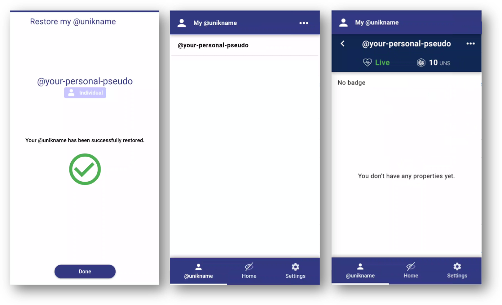
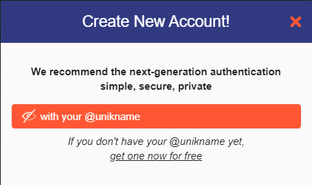

# How to get my first @unikname, with the CLI?

:::tip
Your own @unikname can be used everywhere and for multiple purposes. Also, if you already get one you don't need to get another one.
:::

There's multiple ways to get your own @unikname. The most user friendly one is to [get your @unikname directly within my.unikname.app.](./../2-unikname-id/howto-get-individual-unikname) But here we show you another way with the Command Line Interface which may seems more convenient for a developer or for a system administrator. Then we show you how to restore it within the App.

[[TOC]]

:::warning Prerequisite
:heavy_check_mark: You've already installed the Command Line Interface on your desktop.
<hbox>_See [How to install the CLI?](./howto-install-uns-cli)_</hbox>

:book: Your need to be familiar with the key concept of cryptoaccount and Self-Sovereign ID (SSID).
<hbox>_See [What is a Self-Sovereign ID and crypo accounts?](./../4-key-concepts/what-is-ssid-cryptoaccount)_</hbox>
:::

<hseparator/>

## Step 1. Create a new cryptoaccount, and make a backup of it

So now let's get your own @unikname. To get it with the CLI you need to run two commands, one to create a cryptoaccount and then one to use it to embed your unikname.

:::tip What is a Crypto Account?
A crypto Account is a digital account maintained in a highly secure way by a decentralized network, a blockchain, in which all transactions between you and others are recorded. It is safer than a bank account.
:::

Open your terminal on your desktop and enter the following first command: 
```bash 
uns cryptoaccount:create
```

Your cryptoaccount is immediately created. It has two unique public numbers called the **address** and the **publickey**, and is protected by two private secrets, the **privateKey** and the **passphrase**. 

Here is an example of what you see on your screen:
```bash
uns cryptoaccount:create
» :warn: Backup your cryptoaccount information in a secure place.
{
  "address": "UgjxSEVso19wyURgVSGGAPSVLNGd98YV9B",
  "publicKey": "02174192b83419a3a41c8063ba07946fca130f6069b314e63dbd5dcfa929e15dfd",
  "privateKey": "****************************************************************",
  "passphrase": "**** ****** ***** ****** ******** ***** ********* ******* ****** ***** **** ******",
  "network": "livenet"
}
```
> NOTA: In your case the stars are replaced by real values and the address and the publicKey are your own ones.

Then make an immediate backup of these information in a safe place. 

:::danger 
It is very important to save your cryptoaccount information at this stage! **There's no way to recover it** nor to look for it later. **So do it right now!**

- Take care of spelling the 12 words of the passphrase. You should be able to access it for all your life long.
- If you use a password safe solution like lastpass or keepass you're encouraged to save it on it
:::

## Step 2. Choose and create your own @unikname identifier

Okay now you can create you own individual @unikname. 

This @unikname may be your own for your life long, at least as long as you decide to keep it. You will use it to get access to your business account but also on your day to day life to login on any website or to authenticate informations on the web. So keep it **simple** and **easy to remember**. It could be your pseudo, your real name, or any funny name, it's up to you to decide.

:::tip Information
@unikname IDs for Individuals and @unikname IDs for Organization are different in their uses and in their capabilities. Here you need to create your individual one. We'll see how to create the one for your organization later on.
:::

For a free @unikname choose one longer than 15 characters. The shorter ones are to be bought because they are rarer.

Your @unikname is case, accent and hseparator insensitive. That means that if you choose `your-personal-pseudo` then it's the same as `YourPersonalPseudo` or `your*personal*p.s.e.u.d.ô`

In the example here above just replace ``your-personal-pseudo`` by your own identifier.

```bash
$ uns unik:create --type=individual --explicitValue="your-personal-pseudo" --coupon="LATIN-FREE-UNIKDOC"
```

The CLI ask you for the passphrase of your cryptoaccount, then the result should looks like this:

```bash
Enter your crypto account passphrase (12 words phrase): *****************************
{
  "data": {
    "id": "2e5ae117eaf17b113ab5f01defc851730bbddbb5d9d3c00c462778be62a9134e",
    "transaction": "f9718b85d6f88306e9eb3af4aa686897b8443e19251684976a6874c7f06a8378",
    "confirmations": 1
  }
}
```
:::danger
You @unikname is obfuscated within the blockchain so that means **nobody knows it unless you**. It's very important you remember the @unikname you've chosen! Nobody can help you to look for it nor to recover it. It's a good practice to write it close to the pass phrase you've just backed-up.
:::

## Step 3. Check your @unikname with the name resolver 

One interesting tool provided by the CLI is the name resolver. You can query the network and check quickly every @unikname.

Let's try to check ``@your-personal-pseudo`` status:
```bash
$ uns resolve "@your-personal-pseudo?*" --format=raw
```

This returns the public address of the crypto account of ``@your-personal-pseudo``:
```
UgjxSEVso19wyURgVSGGAPSVLNGd98YV9B
```

Done :+1:

:::tip
Your @unikname is called a DID, a Decentralized ID, because it has a unique Identifier within the uns.network blockchain.
If you try to resolve a name that doesn't exist on the network then the command returns the message "DID not resolved"
:::

## Step 4. Restore your @unikname within the App

Ok, now that your @unikname has been created and its cryptoaccount information have been saved in a safe place, you can use it to authenticate.

To use your individual @unikname to authenticate or to login to a website you need to use the Unikname App. So let's install the App and enlist your @unikname within it.

:::warning 
Unikname is a modern App, developed with the latest technology called a PWA. That means it's not available for download on an App Store, its automatically installed from a web URL.

More info on our blog post &rightarrow; [Progressive Web App (PWA) — The Next Generation of Applications](https://kover.link/wYyLn3)

:::

Open a Chrome or Brave internet browser on your Android Smartphone or the Safari internet Browser on your iPhone/ihbox. Then go to [my.unikname.app](https://kover.link/c8rMyT).

During the installation process you will have to setup your PIN Code. This PIN is specific to your Smartphone. It will be requested to unlock your app.

Until done you're going to choose `restore your @unikname` button, and follow the process.



## Step 5. Use your @unikname to signup or login

It's time to test <brand name="UNC"/> with your own @unikname SSID. 

So let's sign-up to our forum: [https://forum.unikname.com](https://forum.unikname.com/signup)

<hpicture><a href="https://forum.unikname.com/signup"></a></hpicture>

Choose "with your @unikname" and enter your own @unikname. 

<hpicture></hpicture>

Follow the process on the forum.

**All done!** 

<hseparator/>

---

What you've achieved here:

:heavy_check_mark: Created and backup you crypto account    
:heavy_check_mark: Choosen and created your own @unikname ID   
:heavy_check_mark: Checked your @unikname with the name resolver     
:heavy_check_mark: Installed the App enlist your @unikname within it   
:heavy_check_mark: Sign-up to our forum with your own @unikname    

<br/>

:::tip Need Help? 

Open a thread on our [Unikname forum](https://kover.link/5CBGgD)
:::
