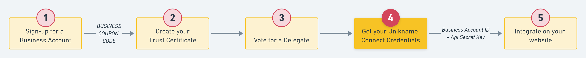

# How to get your Unikname Connect Credentials?

Your credentials are composed of a `Unikname-Connect account id` and an `api secret key`. These credentials are required to setup your website with the Unikname Connect plugin or with any other integration mode. Here we explain how to get them.

:::warning Prerequisites
:heavy_check_mark: You've created your UniknameID of type organization and linked it to the domain name of your website (step 2)
<hbox>_See [How to get and setup the Unikname Trust Certificate for your organization?](./howto-get-unikname-trust-certificate-organization)_</hbox>
:heavy_check_mark: You've voted for delegate to secure the network (step 3)
<hbox>_See [How to vote for a delegate?](./howto-vote-for-delegate-organization)_</hbox>
:::

:::tip Information
:checkered_flag: We plan to provide you an online solution to get your credential. It's under development. In the meantime you need to get in contact with our support team to do it.
:::

So, send us an email to [support@unikname.com](mailto:support@unikname.com?subject=sign-up%20for%20a%20Unikname%20Connect%20Account%20-%20credentials&body=Hi%20Unikname%20Support%20Team%2C%20%0A%0AWe%27re%20finishing%20the%20process%20to%20set-up%20your%20account.%0A%0AThe%20%40unikname%20ID%20of%20type%20organization%20we%27ve%20created%20is%3A%20%3F%0A%0AThank%20you%20to%20send%20us%20our%20credentials%20to%20integrate%20Unikname%20Connect%20on%20our%20website.%0A%0ALooking%20forward%0A%0A) with the UniknameID of type organization you've created

Our support team is going to generate your credentials and to send it back to you.

Well done! Now you're ready for the last step: the integration itself.

Let's go!
