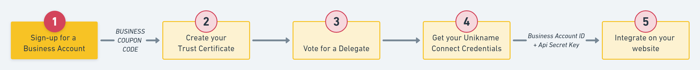

# How to sign-up for your Unikname-Connect Account?

Signing-up for a Unikname-Connect account is required to install and run Unikname Connect solution on your website, whatever the plan you've chosen.

This sign-up process is quite easy, you only need to send to us some information about your website and after some quick checks we generate and send to you your specific **``BUSINESS COUPON CODE``** to be used during the integration process.

:::tip Information
:checkered_flag: We plan to provide you solution to sign-up your Unikname-Connect account online. It's under development. In the meantime you need to get in contact with our support team to do it.
:::

So, send us an eMail to [business-hotline@unikname.com](mailto:business-hotline@unikname.com?subject=sign-up%20for%20a%20business%20account&body=Hi%2C%0A%0AI%20would%20like%20to%20sign-up%20for%20a%20Unikname%20business%20account.%20Here%20are%20the%20requested%20information%3A%20%0A%0A-%20the%20URL%20of%20the%20website%20I%20would%20like%20to%20integrate%20Unikname%20Connect%20%3D%20%3F%0A-%20the%20legal%20name%20of%20my%20organization%20%3D%20%3F%0A-%20my%20full%20name%20and%20my%20role%20in%20the%20organization%20%3D%20%3F%0A-%20my%20eMail%20%3D%20%3F%0A-%20my%20phone%20number%20(including%20the%20country%20code)%20%3D%20%3F%0A%0AThank%20you%20) with the following information:

- the URL of the website where you're integrating Unikname Connect.
- the legal name of your organization
- your full name and your role in the organization
- your eMail
- your phone number, including the country code

and you're going to receive your **``UNIKNAME-CONNECT COUPON CODE``** in the following open hours. 

This UNIKNAME-CONNECT COUPON CODE looks like this: `UNC-xyz999`
> _Where xyz999 is replace by a unique code for you_

:::tip Information
If you've not been in touch with our business development team yet, then they're going to plan a short call with you to initiate our partnership.
:::

What you've achieved up to now:

:heavy_check_mark: Transmitted your Unikname-Connect Account information  
:heavy_check_mark: Unikname team has generated activating information for your Unikname-Connect Account
:heavy_check_mark: Received your UNIKNAME-CONNECT COUPON CODE  

Well done, during the next step you're going to create and setup your Unikname Trust Certificate.