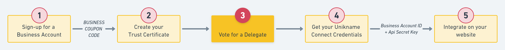
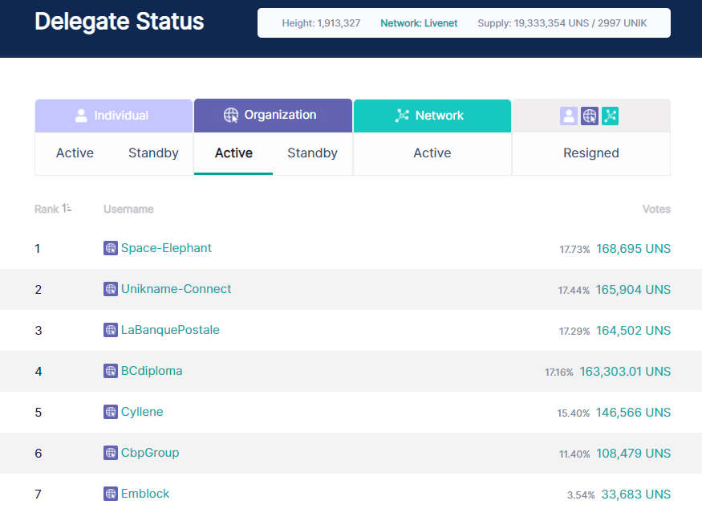

# How to vote for your delegate?



Unikname Authentication solution is based on the <brand name="uns"/> blockchain secured by 23 delegates. These delegates are stakeholders, like you, who're using the network for their own needs and who've setup their own network node. They've decided to contribute to secure the network by registering as delegate. Elected delegates are allowed to validate blocks of transactions and get rewards every 8 seconds. 

Here we explain how to chose and vote for your delegate.

:::warning Prerequisite
:heavy_check_mark: You've already installed the Command Line Interface tool on your desktop.  
<hbox>_See [How to install the CLI?](./howto-install-uns-cli)_</hbox>
:heavy_check_mark: You've created your Trust Certificate (step 2)
<hbox>_See [How to get and setup the Unikname Trust Certificate for your organization?](./howto-get-unikname-trust-certificate-organization)_</hbox>

:book: Your need to be familiar with the key concept of the Unikname blockchain: uns.network.
<hbox>_See [What is the added value of the blockchain?](./../4-key-concepts/what-is-added-value-of-blockchain)_</hbox>
<hbox>_See [What are network player stakeholders and delegates?](./../4-key-concepts/what-are-stakeholders-delegates)_</hbox>
:::

<brand name="uns"/> delegates are split in three colleges: 
- network community, composed of 3 fixed members.
- organizations, composed of 10 elected members.
- individuals, composed of 10 elected members.

:::tip Information
If there's less than 10 registered delegates of type organization, seats are given to individuals.
:::

As an organization you're called to vote for a registered delegate in the organization college.

<hpicture caption="Snapshot of registered delegates of type organization, by Oct 10th, 2020"></hpicture>

:::tip
The updated list of delegates is available in realtime in the [uns.network explorer](https://explorer.uns.network/delegate-status).  
You're welcome to [discuss with delegates in the Unikname Forum](https://forum.unikname.com/c/un-business).
:::

Voting for a delegate of type organization requires a simple line of command with the CLI:

```bash
$ uns delegate:vote "@organization:SpaceElephant"
```
> NOTA: replace `SpaceElephant` by the delegate you've chosen.

The CLI ask you for your passphrase. Then enter the passphrase of the cryptoaccount of your @unikname ID of type Organization, not your individual one.

The CLI outcome confirms your transaction.

:::tip
You can change your vote at any time.
:::

That's it!
