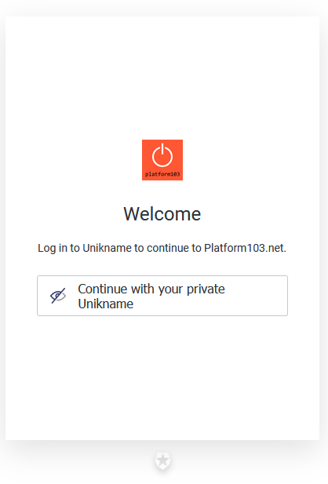
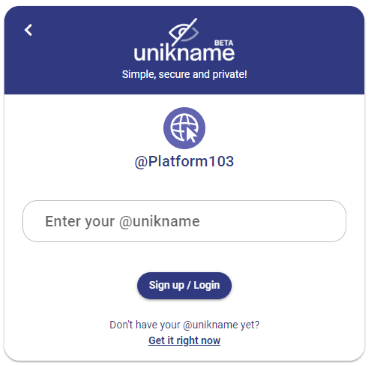

# Integrate Unikname Connect with Auth0

<hpicture noshadow></hpicture>

 

<brand name="UNC"/> can be easily integrated with any solution already configured with the Auth0 product. 

[Auth0](https://auth0.com) is a flexible, drop-in solution to add authentication and authorization services to your applications. Auth0 enables to connect any application, written in any language or on any stack, with the identity providers of your choice.
In other words you can decide how you want your users to login: eMail, Social Authent, Active Directory... and <brand name="UNC"/>.

:::tip Example
We are running a live example of integrating Unikname Connect with Auth0 on [**platform103.net**](https://www.platform103.net).
This demo website has been coded and setup to sign-up ang login with Auth0.

👉 You're welcome to [Run this example](https://www.platform103.net) with your own @unikname.
:::

Here under you will see how to setup your Auth0 account to use Unikname Connect.

**Table of Content**

[[TOC]]

<hseparator/>

## Prerequisites

:::warning Prerequisites
:heavy_check_mark: You've already obtained your own @unikname SSID
<hbox>_See [How to get your personal @unikname with the CLI?](./howto-get-my-unikname-via-cli)_</hbox>
:heavy_check_mark: You've signed-up for a business account
<hbox>_See [How to sign-up for a business account?](./howto-signup-business-account)_</hbox>
:heavy_check_mark: You've got and setup the Trust certificate for your website
<hbox>_See [How to get and setup the trust certificate for your website?](./howto-get-unikname-trust-certificate-organization)_</hbox>
:heavy_check_mark: During the sign-up process you've received a set of keys.
_</hbox>

:book: We assume you've access to your Auth0 account.
<hbox>If you don't have used Auth0 yet, follow the [Get Started](https://auth0.com/docs/quickstarts) Auth0 tutorial.</hbox>
:::

## Step 1. Configure your Auth0 service

Once your Auth0 application has been created, you can add an `Enterprise Connection`. Use `Open Id Connect` link.

Fill-in the following required fields to setup <brand name="UNC"/>: 

| Attribut | Value / Description |
|--------|-----------|
| `Connection name` | It's an internal name (Ex: `unikname-connect`) |
| `Display name` | Enter `your private @unikname`. It will display `Continue with your private @unikname` on the connection button |
| `Logo url` | Add this url `https://cdn.unikname.com/logos/20/un-blue-nbt.png` to display the Unikname icon on the button  |
| `Issuer URL` | <UncServerUrl/> |
| `Client ID` | The client ID you have received from Unikname's support request |
| `Client Secret` | The client secret you have received from Unikname's support request |

## Step 2. Enable your `Open ID Connect` Connection for your Auth0 application

Go to your application connections list and enable the `unikname-connect` `Open ID Connect` connection.

## Step 3. Test Unikname Connect on your website

Go to your website and click on the `sign-up` button. You should see a signup screen like this one:

<hpicture noshadow></hpicture>

Click on the button, then you should see this page:

<hpicture noshadow></hpicture>

Finally enter your personal @unikname and validate the authentication on your smartphone. You're automatically redirected to the signup process on your forum.

**All done!**

New users are now able to use their @unikname SSID to sign-up to your website.

<hseparator/>

## Troubleshooting

If you’re having issues when connecting (access denied ...), check that the credentials (the @unikname of your organization, Unikname Connect secret, client id/secret ...) you are using to connect to <brand name="UNC"/> authentication server are the good one.

!!!include(.vuepress/md-templates/need-help.md)!!!
