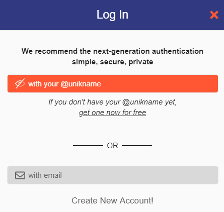

# Integrating Unikname Connect with Discourse

!!!include(.vuepress/md-templates/unc-registering-process-what-is-unc.md)!!!

## About Discourse


<brand name="UNC"/> can be easily integrated within opensource frameworks compatible with the standard OAuth authorization protocol.

In this example, [our discussion forum website](https://forum.unikname.com/) is based on the famous open source [Discourse forum solution](https://www.discourse.org).
<brand name="unikname"/> users are automatically signed in for an optimal user experience.

👉 [Run this example](https://forum.unikname.com/)

**Table of Content**

[[TOC]]

!!!include(.vuepress/md-templates/unc-registering-process-start.partial.md)!!!

## Discourse plugin installation

- Connect to your Discourse server (sorry, you can't install a plugin from the admin panel 😞)
- Access your container’s `app.yml` file (it should be present in `/var/discourse/containers/`)

    cd /var/discourse
    nano containers/app.yml

Add the Discourse Unikname Connect plugin’s repository URL to your container’s `app.yml` file:

```
hooks:
  after_code:
    - exec:
        cd: $home/plugins
        cmd:
          - ...
          - sudo -E -u discourse git clone https://github.com/unik-name/discourse-unikname
```

(Add the plugin’s `git clone` url just below `sudo -E -u discourse git clone https://github.com/discourse/docker_manager.git`)

Rebuild the container:

    cd /var/discourse
    ./launcher rebuild app

That’s it, you’ve successfully installed the Unikname Connect plugin on your Discourse instance!

## Discourse setup

A an admin, go to the Discourse "burger" menu → admin → "Settings" tab → "Plugin" category.

You can also go to `https://<your_discourse_forum_url>` `/admin/site_settings/category/plugins?filter=plugin%3Adiscourse-unikname`

Then, configure the following attributes:

| Attribut | Description |
|--------|-----------|
| `unikname connect enabled`  | Of course, check this box to enable Unikname Connect login for your users |
| `unikname connect unikname key` | The key you have received from Unikname's support request |
| `unikname connect secret` | The secret you have received from Unikname's support request |
| `unikname connect authorize scope` | `openid` by default, or `openid email` if you want to ask for the user to share his email address |

## Discourse check user login

Your users should now be able to use <brand name="UNC"/> to connect to your website and to see this kind of login screen:



!!!include(.vuepress/md-templates/unc-registering-process-end.partial.md)!!!
