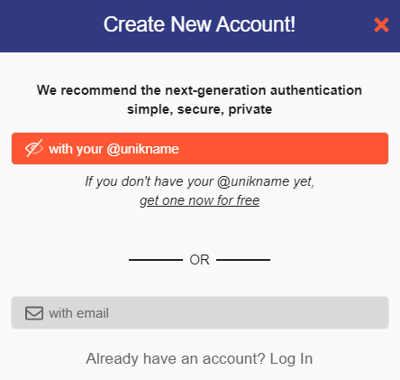
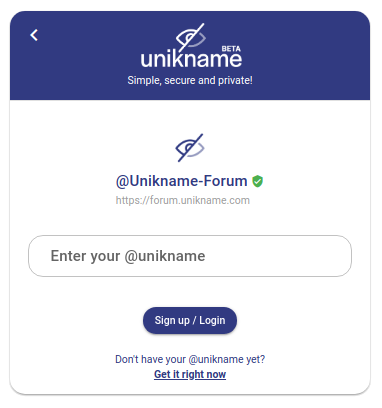

# How to integrate Unikname Connect with Discourse?


<hpicture noshadow></hpicture>

<br/>

<brand name="UNC"/> can be easily integrated with Discourse with a simple plugin. 

<brand name="UNC"/> has been designed to work with open-source solutions compatible with the OAuth/OpenID Connect authorization standard protocol. The famous open-source [Discourse forum solution](https://www.discourse.org), respectful of user privacy, is one of them. 

:::tip Example
Our discussion Forum website has been built with Discourse. 

👉 You're welcome to [sign-up on our forum](https://forum.unikname.com/) with your own @unikname.
:::

To make integration very easy we've developed a specific ready-to-use plugin. Here under you will see how to install and setup this Discourse plugin.

[[TOC]]

<hseparator/>

:::warning Prerequisites
:heavy_check_mark: You've already obtained your own @unikname SSID
<hbox>_See [How to get your personal @unikname with the CLI?](./../../howto-get-my-unikname-via-cli)_</hbox>
:heavy_check_mark: You've signed-up for a business account. Required to get your API keys.
<hbox>_See [How to sign-up for a business account?](./../../howto-signup-business-account)_</hbox>
:heavy_check_mark: You've got and setup the Trust certificate for your website
<hbox>_See [How to get and setup the trust certificate for your website?](./../../howto-get-unikname-trust-certificate-organization)_</hbox>
:heavy_check_mark: During the sign-up process you've received your Business Account ID and your API secret key.

:book: We assume you're familiar with the Discourse installation process.
:::

## Step 1. Install Discourse plugin

Connect to your Discourse server, and access your container’s `app.yml` file. It should be present in `/var/discourse/containers/`)

:::tip Information
you can't install a plugin from the admin panel 😞
:::

Enter the following command to edit your yml config file:
```bash
cd /var/discourse
nano containers/app.yml
````

Add the Discourse Unikname Connect plugin’s repository URL to your container’s `app.yml` file:

```
hooks:
  after_code:
    - exec:
        cd: $home/plugins
        cmd:
          - ...
          - sudo -E -u discourse git clone https://github.com/unik-name/discourse-unikname-connect-authentication-plugin
```

> Add the plugin’s `git clone` url just below `sudo -E -u discourse git clone https://github.com/discourse/docker_manager.git`)

Rebuild the container:
```bash
cd /var/discourse
./launcher rebuild app
```

That’s it! You’ve successfully installed the Unikname Connect plugin on your Discourse instance!

## Step 2. Setup Discourse plugging

As an admin, go to the Discourse "burger" menu → admin → "Settings" tab → "Plugin" category.

You can also go to `https://<your_discourse_forum_url>` `/admin/site_settings/category/plugins?filter=plugin%3Adiscourse-unikname-connect-authentication-plugin`

Then, configure the following attributes:

| Attribut | Description |
|--------|-----------|
| `unikname connect enabled`  | Of course, check this box to enable Unikname Connect login for your users |
| `unikname connect Business Account ID` | The Business Account ID you have received from Unikname's support request |
| `unikname connect API secret key` | The API secret key you have received from Unikname's support request |
| `unikname connect authorize scope` | `openid` by default |

## Step 3. Test Unikname Connect on your Discourse Forum

Go to your Discourse Forum and click on the `sign-up` button. You will see this new signup screen:

<hpicture></hpicture>

Choose ``with your @unikname`` button, then you should see this page:

<hpicture noshadow></hpicture>

Finally enter your personal @unikname and validate the authentication on your smartphone. You're automatically redirected to the signup process on your forum.

:::tip Information
If you already have an account on your website, with your email, then you can Login to your forum with your eMail then go to preferences on your profil page, and link your @unikname with your account. For more info read the good [post published by the community on our forum](https://forum.unikname.com/t/how-to-login-with-your-unikname-if-your-already-have-an-account/562).
:::

**All done!**

New users are now able to use their @unikname SSID to sign-up to your Discourse Forum, and existing users can now link their account with their @unikname for further login with it.

<hseparator/>

## Troubleshooting

If you’re having issues when connecting (access denied ...), check that the credentials (the @unikname of your organization, Unikname Connect secret, client id/secret ...) you are using to connect to <brand name="UNC"/> authentication server are the good one.

