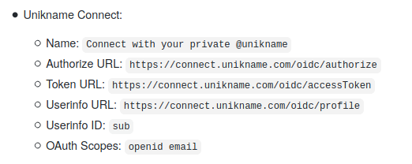

# How to sign-up to Matomo with my @unikname

<hpicture noshadow></hpicture>

 

It is easy to connect to Matomo with my @unikname with a simple plugin and a very fast configuration.

**Table of Content**

[[TOC]]

<hseparator/>

## Prerequisites

:::warning Prerequisites
:heavy_check_mark: You've already obtained your own @unikname SSID
<hbox>_See [How to get your personal @unikname with the CLI?](./howto-get-my-unikname-via-cli)_</hbox>
:heavy_check_mark: You've signed-up for a business account. Required to get your API keys.
<hbox>_See [How to sign-up for a business account?](./howto-signup-business-account)_</hbox>
:heavy_check_mark: You've got and setup the Trust certificate for your Matomo business account
<hbox>_See [How to get and setup the trust certificate for your website?](./howto-get-unikname-trust-certificate-organization)_</hbox>
:heavy_check_mark: During the sign-up process you've received your Business Account ID and your API secret key.

:::

## Step 1. Install Login OIDC plugin

Install it via Matomo Marketplace, or from the [original repository](https://github.com/dominik-th/matomo-plugin-LoginOIDC)

## Step 2. Setup Login OIDC plugin

As an admin, go to ???.

<hpicture></hpicture>

Then, configure the following attributes:

<hpicture></hpicture>

## Step 3. Connect with your @unikname

Go to your Matomo space and click `Login-in` button then `CONNECT WITH YOUR PRIVATE @UNIKNAME`.

<hpicture></hpicture>

You should see this page:

<hpicture noshadow></hpicture>

Finally enter your personal @unikname and validate the authentication on your smartphone. You're automatically redirected to the signup process on your forum.

## Step 4. Link your @unikname to your Matomo account

It is very easy to associat your @unikname to your Matomo account. On Settigs / Personal Settings, then `OpenID Connect`.

<hpicture></hpicture>

And enter your @unikname. That's all!

