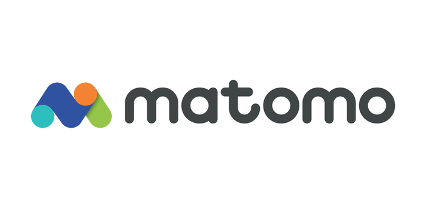
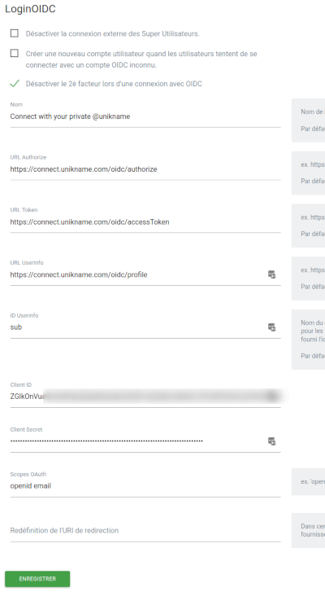
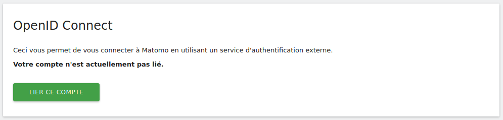
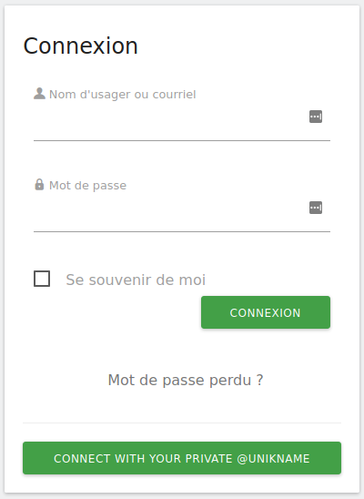

# How integrate Unikname Connect with Matomo?

<hpicture noshadow></hpicture>

 

It's easy to connect to Matomo with its @unikname with a simple plugin and a very fast configuration.

<brand name="UNC"/> has been designed to work with open-source solutions compatible with the OAuth/OpenID Connect authorization standard protocol. The famous open-source [Matomo analytics solution](https://matomo.org/), the Google Analytics alternative that protects your data and your customers' privacy, is one of them. 

**Table of Content**

[[TOC]]

<hseparator/>

## Prerequisites

:::warning Prerequisites
:heavy_check_mark: You've already obtained your own @unikname SSID
<hbox>_See [How to get your personal @unikname with the CLI?](./howto-get-my-unikname-via-cli)_</hbox>
:heavy_check_mark: You've setup your matomo account.

:::

## Step 1. Install Login OIDC plugin

Install it via Matomo Marketplace (for [Matomo 3](https://plugins.matomo.org/LoginOIDC?matomoversion=3) or [Matomo 4](https://plugins.matomo.org/LoginOIDC?matomoversion=4)), or from the [original repository](https://github.com/dominik-th/matomo-plugin-LoginOIDC).

## Step 2. Setup Login OIDC plugin

- As an admin, go to the administration panel of your Matomo instance
- Go to the `General settings`
- In the page, look for `LoginOIDC` section (see below)

<hpicture></hpicture>

Then, configure the following attributes:

| Attribut | Value |
|--------|-----------|
| Name | `Connect with your private @unikname` |
| Authorize URL | `https://connect.unikname.com/oidc/authorize` |
| Token URL    | `https://connect.unikname.com/oidc/accessToken`    |
| Userinfo URL | `https://connect.unikname.com/oidc/profile`    |
| Userinfo ID | `sub`    |
| OAuth scopes |`openid email` |

## Step 3. Link your @unikname to your Matomo admin account

To be able to login with **your actual** Matomo account with your @unikname, you need to link them together. It is very easy to do it.

Go to _Settings / Personal Settings_, then look for `OpenID Connect` in the page.

You should see a screen like this one:

<hpicture></hpicture>

Click on `Link this account` button and then connect with your @unikname.

You should see a page like:

<hpicture noshadow></hpicture>

At the end of the process, your @unikname and Matomo account are linked together, so you can login to your Matomo account with your @unikname.

## Step 4. Test to login to your Matomo instance with your @unikname

Disconnect from your Matomo instance and then go to the login page.

Just click `CONNECT WITH YOUR PRIVATE @UNIKNAME`.

<hpicture></hpicture>

You should see -again 😉- a page like:

<hpicture noshadow></hpicture>

Finally enter your @unikname and validate the authentication on your smartphone. 

That's it, you are now logged in your Matomo instance as an admin!

<hseparator/>

## Troubleshooting

If you’re having issues when connecting (access denied ...), check that the credentials (the @unikname of your organization, Unikname Connect secret, client id/secret ...) you are using to connect to <brand name="UNC"/> authentication server are the good one. 
