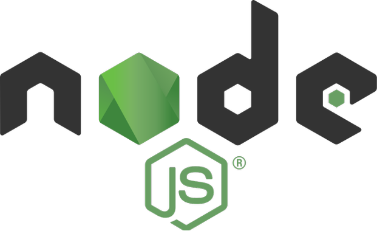
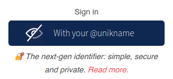

# How to integrate Unikname Connect with Node.JS?


<hpicture noshadow></hpicture>

<br/>

<brand name="UNC"/> can be integrated with any Node.js based web applications.
[Node.js](https://nodejs.org/) is an open-source, cross-platform, back-end, JavaScript runtime environment that executes JavaScript code outside a web browser. Node.js lets developers use JavaScript for server-side scripting—running scripts server-side to produce dynamic web page content before the page is sent to the user's web browser.

[[TOC]]

<hseparator/>

:::warning Prerequisite
:heavy_check_mark: You've already obtained your own @unikname SSID
<hbox>_See [How to get your personal @unikname with the CLI?](./../../howto-get-my-unikname-via-cli)_</hbox>
:heavy_check_mark: You've signed-up for a business account
<hbox>_See [How to sign-up for a business account?](./../../howto-signup-business-account)_</hbox>
:heavy_check_mark: You've got and setup the Trust certificate for your website
<hbox>_See [How to get and setup the trust certificate for your website?](./../../howto-get-unikname-trust-certificate-organization)_</hbox>
:heavy_check_mark: During the sign-up process you've received your Business Account ID and your API secret key.

:book: We assume you're familiar with Node.js programming language.

The following guide is written for:
- Node.js version `>=12.0.0` recommended, but `^10.19.0`/`lts/dubnium` also supported
- Express 4.x
:::

What we are doing is simple: adding new dependencies to support the OpenID Connect protocole used by <brand name="UNC"/>, then configuring your application to use these dependencies, coding a few lines and finally, adding the "Connect with your private @unikname" button.

## Step 1. Add dependencies to your Web Application

The first thing you’ll need is the following NPM packages:
- [Passport](http://www.passportjs.org)
- [express-session](https://www.npmjs.com/package/express-session)
- [memorystore](https://www.npmjs.com/package/memorystore), an `express-session` full featured MemoryStore module without leaks!
- [openid-client](https://github.com/panva/node-openid-client), a [Certified OpenID Connect Implementations](https://openid.net/developers/certified/)

With `npm`:

    $ npm install passport@ express-session memorystore openid-client --save

With `yarn`:

    $ yarn add passport@ express-session memorystore openid-client

Once those are installed, open the main application `.js` file of your application and "require" the new dependencies so that the top section of the file looks like:

```javascript
// Maybe existing dependencies
const express = require('express');
...

// Unikname Connect required dependencies 
const passport = require('passport');
const session = require('express-session');
const MemoryStore = require('memorystore')(session)
const { Issuer, Strategy } = require('openid-client');
```

<hseparator/>

## Step 2. Code the OpenID Connect logic flow

### Configure Express session

In order for Passport to use Express session, we must configure it first.

By default, if you have a one-server web application, a robust in-memory session store is enough, such as the one provided by [`memorystore`](https://www.npmjs.com/package/memorystore).

You can append the following code to your application `.js` file and you should be ready to go.

```javascript
app.use(session({
  secret: 'HereIsASecretYouMustChangeForYourEnvironment', //  change this
  cookie: { maxAge: 86400000 }, // 24h
  store: new MemoryStore({
    checkPeriod: 86400000 // prune expired entries every 24h
  }),
  resave: false,
  saveUninitialized: false // but true if you're using session for storing other data
}));
```

If you have different requirements, you can read more about [how to configure Express session](https://github.com/expressjs/session#readme).

Of course, you can also reuse your existing Express session configuration.

### Configure Express to use Passport.js

After we configured Express session, we can initialize Passport and tell it to use session by appending the following code to `.js` application file.

```javascript
app.use(passport.initialize());
app.use(passport.session());
```

### Set up openid-client

To communicate with our <brand name="UNC"/> server, you will be using `openid-client` which is on the list of [Certified OpenID Connect Implementations](https://openid.net/developers/certified/).

The best way to get initialized openid-client `Issuer` instance is by calling the `discover` function and passing the <brand name="UNC"/> authorization server URL as an argument.

The function then loads the standard OpenID Connect Authorization Server Metadata document and return a promise for the initialized issuer object.

```javascript
// The Business Account ID you have received from Unikname's support request
const uniknameConnectBusinessAccountId = ...; // should be read from environment variables

// The API secret key you have received from Unikname's support request
const uniknameConnectApiSecretKey = ...; // should be read from environment variables

const uniknameConnectIssuer = await Issuer.discover('https://connect.unikname.com/oidc/.well-known/openid-configuration');

var client = new uniknameConnectIssuer.Client({
  client_id: uniknameConnectBusinessAccountId,
  client_secret: uniknameConnectApiSecretKey,

  // This URL will be called later by your user's browser at the end of connection process
  redirect_uris: [ 'https://<YOUR_HOST:PORT>/auth/unikname/callback'], // You need the real hostname here, and the real protocol (http/https), as it is called by your user's browser at execution time

  response_types: ['code'],
});


// Your existing code, or quite similar, AFTER calling Issuer#discover
// catch 404 and forward to error handler
app.use(function(req, res, next) {
  ...
});

// error handler
app.use(function(err, req, res, next) {
  ...
}
```

You should load this at the beginning of the startup of your server, and you might reload it regularly.

| Attribut | Description |
|--------|-----------|
| `uniknameConnectBusinessAccountId` | The Business Account ID you have received from Unikname's support request |
| `uniknameConnectApiSecretKey` | The API secret key you have received from Unikname's support request |

:::warning Declare 404 and errors handlers at the right place

Because `Issuer#discover` is an async function, make sure to put 404 and error handlers, created by Express app generator, **AFTER** the client initialization, as shown in the example above.

:::

### Initialize openid-client strategy for Passport

When providing a strategy for the Passport, you have to pass two arguments to the `use` function:
- the strategy name
- the initialized strategy object

To initialize the strategy imported from openid-client, you have to call a constructor with two arguments:
- settings object containing at least the initialized client
- a callback function to execute after you receive user information from <brand name="UNC"/> authentication provider

To properly set up a strategy, you can append the following code to your `.js` application file.

```javascript
const params = {
  scope: 'openid', // Unikname Connect might handle the 'email' scope in the future
};

passport.use(
  'unikname',
  new Strategy({ client, params }, (tokenSet, userinfo, done) => {
    // userinfo structure
    // {
    //  "sub":"hgBSa9tHIFfRhMyfNiNlx8ko_7SFAc_7L5Xa91ZOex4",
    //  "auth_time":1602855803,
    //  "id":"hgBSa9tHIFfRhMyfNiNlx8ko_7SFAc_7L5Xa91ZOex4"
    // }

    // Here is the place where you can try to find this user from your database
    // or from any other user's profile store
    const user = userinfo; // for this example, just copy userinfo object

    return done(null, user); // so that all user's info will be available in any req.user
  })
);
```

#### Objects type

- `userinfo`: `<Object>`

  - `sub`: `<string>` You're user's identifier. **Stable and unique** for your application.

    Eg.: `hgBSa9tHIFfRhMyfNiNlx8ko_7SFAc_7L5Xa91ZOex4`

  - `id`: `<string>` Alias for `sub`

  - `auth_time`: `<string>` User's authentication time as a UNIX timestamp.
    
    Eg. `1602855803`

### Final Passport configuration

The last thing you need to finish setting up Passport is to provide a function to serialize and deserialize the user received from <brand name="UNC"/> authentication provider.
Append the following code to your `.js` application file.

```javascript
passport.serializeUser(function(user, done) {
  // 'user' as the same content as 'user' above
  done(null, user);
});

passport.deserializeUser(function(user, done) {
  done(null, user);
});
```

💪 That's all for Passport, Express session and openid-client configurations.
Let's now configure Express routes to handle the login flow.

<hseparator/>

## Step 3. Configure HTTP routes

Now that we have set up openid-client, Passport and Express session, it is time to trigger your first user's login.
Setting up <brand name="UNC"/> authentication flow requires new routes: one for handling the end of the connection process and one for initiating it.
With these routes, you will be able to do your first integration test to check your configuration.

### HTTP route for the authentication callback (redirect URI flow)

After being successfully authenticated by <brand name="UNC"/>, your user's will be redirected (their browser indeed 😊) to the authentication redirect route which you provided when [you initialized the openid-client previously](#set-up-openid-client).

So you have to create an Express route which handles the callback and authenticates the user.

To do that, you simply have to call the `authenticate` function of Passport and pass it the strategy name and an object containing following properties:

- `successRedirect`: where to redirect if the <brand name="UNC"/> authentication was successful
- `failureRedirect`: where to redirect if the <brand name="UNC"/> authentication was unsuccessful

Append the following code to your `.js` application file:

```javascript
app.get('/auth/unikname/callback', (req, res, next) => {
  passport.authenticate('unikname', {
    successRedirect: '/secured-home', // replace this by the home page of your user on your web application
    failureRedirect: '/', // replace this by the error page of your web application
  })(req, res, next);
});
```

`/secured-home` is the home of successfully authenticated users and he label of this route can be whatever you want.
You will [come back later on this configuration](#step-4-set-up-ui-components).

### HTTP route to initiate the login flow

Now, you need to configure the route which initiates the login flow of your users, by appending the following code to your `.js` application file:

```javascript
app.get('/auth/unikname', (req, res, next) => {
  passport.authenticate('unikname')(req, res, next);
});
```

Here, you can now do your first integration test to check if your code is working properly.
For this, let's just open your browser at:

    https://<YOUR_HOST:PORT>/auth/unikname

What should happen? You should see:
1. The <brand name="UNC"/> login screen
2. And then, be redirecting to your web application at the end of the login process

If everything is OK, you can continue the set up.

:::tip Handling multiple login routes

We recommend you to name the login route in order to be able to handle multiple login flow, such as email, another OIDC compatible authentication provider ...

In the example above, the name is `/auth/unikname` so you could define `/auth/email`, `/auth/github` ...
:::

<hseparator/>

## Step 4. Set up UI components

### "Landing" pages

As seen before, at the end of the login process, you user is redirected to your web application, as [you have already configured before](#http-route-for-the-authentication-callback-redirect-uri-flow).

Let's now using the user info received from <brand name="UNC"/>.

On the page named `/secured-home` in our sample, you can display the user info by extracting them from the Express request:

```javascript
// Route '/secured-home' which renders 'userHome' template
// Example of configuration of this page
// If you already have one, just add the 'req.user' to its context
app.get('/secured-home', (req, res) => {
  res.render('userHome', { user: req.user }); // so 'user' object will be available in your HTML template
});
```

In the snippet above, the `req.user` object comes from the [`user` object previously defined in the openid-client strategy](#initialize-openid-client-strategy-for-passport).
All values of the `user` object will be available in your HTML template to be displayed.

:::tip What to do when the <brand name="UNC"/> authentication fails?

You can redirect the users after unsuccessful authentication to the public homepage of your web application where they can re-attempt to log in and -on success- they will redirect to the `/secured-home` route were they will see their connected home page.

:::

### Add the "Connect with your private @unikname" button

This is the final step: adding the "Connect with your private @unikname" button in your web application.

Your login button should look like that:

<div align="center">



</div>

Your button must call the previously defined route `/auth/unikname`:
- with a submit button with a `GET` action (not a `POST` action)
- or an HTML link

:::tip Using iframes

By default, you are not allowed to load any <brand name="UNC"/> screens into an iframe.
If you want to provide to your user another UX based on an iframe (for eg. with a login pop-in so that a user never leaves you page), please contact [our support to discuss enabling it](mailto:support@unikname.com).

:::

At this point you should have a complete and working authentication flow 💪.

<hseparator/>

## Step 5. Test Unikname Connect on your website

Go to your website and click on the button that should trigger <brand name="UNC"/>, e.g `Sign-up/Login` or `Connect with your private @unikname`.

You should see the <brand name="UNC"/> login screen similar to this:

<hpicture></hpicture>

Then enter your personal @unikname and validate the authentication on your smartphone. Then you're automatically redirected to your website and authenticated.

**All done!**

<hseparator/>

## Troubleshooting

If you’re having issues when connecting (access denied ...), check that the credentials (the @unikname of your organization, Unikname Connect secret, client id/secret ...) you are using to connect to <brand name="UNC"/> authentication server are the good one.

You can also check that you’re using the latest version of the OpenID Connect SDK, library, plugin or service embedded in your application.

