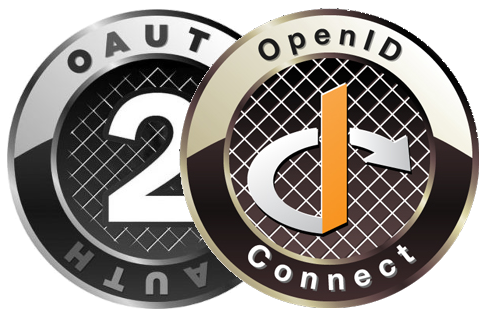

# How to integrate Unikname Connect with OAuth 2.0 or OpenID Connect?

<hpicture noshadow></hpicture>

 

<brand name="UNC"/> can be easily integrated with any website using Auth2.0 or OpenID Connect Authorization protocols.

**Table of Content**

[[TOC]]

<hseparator/>

## Prerequisites

:::warning Prerequisites
:heavy_check_mark: You've already obtained your own @unikname SSID
<hbox>_See [How to get your personal @unikname with the CLI?](./../../howto-get-my-unikname-via-cli)_</hbox>
:heavy_check_mark: You've signed-up for a business account
<hbox>_See [How to sign-up for a business account?](./../../howto-signup-business-account)_</hbox>
:heavy_check_mark: You've got and setup the Trust certificate for your website
<hbox>_See [How to get and setup the trust certificate for your website?](./../../howto-get-unikname-trust-certificate-organization)_</hbox>
:heavy_check_mark: During the sign-up process you've received your Business Account ID and your API secret key.

:book: We assume you're familiar with the Auth2.0 or OpenID protocol.
:::

## Unikname Connect OAuth2.0 / OIDC features

The current implementation of Unikname Connect provides support for:

- Authorization Code Flow
- Implicit Flow
- Standard OAuth2.0 and OIDC endpoints

## OAuth2.0 / OIDC setup

Here are the informations you have to code or set up on your OAuth2.0 service:

| Attribut | Description |
|--------|-----------|
| OIDC discovery document | <UncServerUrl/> |
| OIDC client id | The Business Account ID you have received from Unikname's support request |
| OIDC client secret | The API secret key you have received from Unikname's support request |
| OIDC authorize scopes |`openid` by default. |

### Detailed OAuth 2.0 / OIDC Endpoints

If the generic discovery document URL doesn't work for you, you can configure individual endpoints:

| Endpoint | URL |
|-|-|
| Authorize | `https://connect.unikname.com/oidc/authorize` |
| Token     | `https://connect.unikname.com/oidc/accessToken`    |
| Userinfo  | `https://connect.unikname.com/oidc/profile`    |

<hseparator/>

