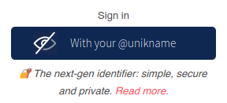

# How to integrate Unikname Connect with Spring Boot applications?


<hpicture noshadow></hpicture>

<br/>

<brand name="UNC"/> can be integrated with any Spring Boot based web applications.
[Spring Boot](https://spring.io/projects/spring-boot) makes it easy to create stand-alone, production-grade Spring based Applications that you can "just run".

**Table of content**

[[TOC]]

<hseparator/>

:::warning Prerequisite
:heavy_check_mark: You've signed-up for a Unikname-Connect account
<hbox>_See [How to sign-up for a Unikname-Connect account?](./../../howto-signup-unconnect-account)_</hbox>
:heavy_check_mark: You've got and setup the Trust certificate for your website
<hbox>_See [How to get and setup the trust certificate for your website?](./../../howto-get-unikname-trust-certificate-organization)_</hbox>
:heavy_check_mark: During the sign-up process you've received your Unikname-Connect Account ID and your API secret key.

:book: We assume you're familiar with Spring Boot and the development of Spring Boot applications.

The following guide is written for:
- JDK 8+ or OpenJDK 8+
- Maven 3+ or Gradle 6+
- Spring Boot version 2.1+
:::

:::warning
 The apps all work on `localhost:8080` because they’ll use OAuth 2.0 clients registered with Unikname for that address.
 To run them on a different host or port, you need to register your apps that way.
 There is no danger of leaking your credentials beyond localhost if you use the default values.
 But, be careful what you expose on the Internet, and don’t put your own app registrations in public source control. 
:::

## Step 1. Add dependencies to your Web Application

To make the application secure, you can simply add Spring Security as a dependency.
Since you’re wanting to do a login delegated to Unikname, you should include the Spring Security OAuth 2.0 Client starter.

The `spring-boot-starter-oauth2-client` dependency provides auto-configuration for Spring Security OAuth2 Client and Spring Security’s support for the JOSE (Javascript Object Signing and Encryption) framework to securely transfer claims between parties including JWT (JSON Web Token), JWS (JSON Web Signature), JWE (JSON Web Signature) and JWK (JSON Web Key)

This client can also be used to implement the OpenID Connect protocole.

Maven:
```xml
<dependency>
	<groupId>org.springframework.boot</groupId>
	<artifactId>spring-boot-starter-oauth2-client</artifactId>
</dependency>
```

Gradle:
```
implementation 'org.springframework.boot:spring-boot-starter-oauth2-client'
```

By adding that, it will secure your app with OpenID Connect by default.

<hseparator/>

## Step 2. Code the OpenID Connect logic flow

### Configure Spring Security

Create a class and extends WebSecurityConfigurerAdapter to configure security for your application

```java
package your.package;

import org.springframework.context.annotation.Configuration;
import org.springframework.security.config.annotation.web.builders.HttpSecurity;
import org.springframework.security.config.annotation.web.configuration.WebSecurityConfigurerAdapter;
import org.springframework.security.web.csrf.CookieCsrfTokenRepository;

@Configuration
public class SecurityConfig extends WebSecurityConfigurerAdapter {
  @Override
  protected void configure(HttpSecurity http) throws Exception {
    http
      .authorizeRequests(r -> r
        // Allow home page / for all
        .antMatchers("/").permitAll()
        // All other requests must authenticated
        .anyRequest().authenticated());

    // Enable CSRF protection
    http.csrf(c -> c.csrfTokenRepository(CookieCsrfTokenRepository.withHttpOnlyFalse()));

    // Redirect to / on logout
    http.logout(l -> l.logoutSuccessUrl("/").permitAll());

    http.oauth2Login(o -> o
      .successHandler((request, response, authentication) -> {
        response.sendRedirect("/");
      }));
  }
}
```

### Set up the OpenID Connect client

To communicate with our <brand name="UNC"/> server, you will be using Spring Security added in the previous section. The best way to get initialized the `Issuer` instance of Spring Security is by configuring the auto-discover method and passing the <brand name="UNC"/> authorization server URL as an argument.

The process then loads the standard OpenID Connect Authorization Server Metadata document and your Spring Boot will by read to handle OpenID Connect flows!

So, just configure `application.yml` and replace `...` with the data received from Unikname Support:

```yaml
spring:
  security:
    oauth2:
      client:
        provider:
          unikname:
            # Issuer URL: the magic comes from here ✨
            issuer-uri: https://connect.unikname.com/oidc
        registration:
          unikname:
            # The Unikname Connect Site ID you have received from Unikname's support request
            client-id: ...
            # The API secret key you have received from Unikname's support request
            client-secret: ...
```

💪 That's all for Spring Security and OAuth2/OpenID Client configurations.
Let's now configure Spring web routes to handle the login flow.

<hseparator/>

## Step 3. Configure HTTP routes

Now that we have set up all the components, it is time to trigger your first user's login.
Setting up <brand name="UNC"/> authentication flow requires HTTP routes:
- one for handling the end of the connection process
- one for initiating it.

With these routes, you will be able to do your first integration test to check your configuration.

### HTTP route for the authentication callback (redirect URI flow)

After being successfully authenticated by <brand name="UNC"/>, your user's will be redirected (their browser indeed 😊) to the authentication redirect route which you provided when [you initialized the OAuth2/OIDC previously](#set-up-the-openid-connect-client).

With OAuth2 Spring Security, the default redirect URI template is `{baseUrl}/login/oauth2/code/{registrationId}`.

That means that adding the `spring-boot-starter-oauth2-client` dependency and the Unikname Connect configuration has automatically added the following HTTP route to your application:

```
http(s)://<YOUR_HOST:PORT>/login/oauth2/code/unikname
```

### HTTP route to initiate the login flow

Your application needs a route which initiates the login flow of your users.
Again, OAuth2 Spring Security provides this by the default, with the following template: `{baseUrl}/oauth2/authorization/{registrationId}`.

That means that adding the `spring-boot-starter-oauth2-client` dependency and the Unikname Connect configuration has automatically added the following HTTP route to your application:

```
http(s)://<YOUR_HOST:PORT>/oauth2/authorization/unikname
```

Here, you can now do your first integration test to check if your code is working properly.
For this, let's just open your browser at:

    http(s)://<YOUR_HOST:PORT>/oauth2/authorization/unikname

What should happen? You should see:
1. The <brand name="UNC"/> login screen 🥳
2. And then, be redirecting to your web application at the end of the login process

If everything is OK, you can continue the set up.

### HTTP route to get the information of the current authenticated user

You can **optionally** the following route to be able to get from your front-end UI the information of the current authenticated user.
You can query it with a classic AJAX/Fetch request.

```java
package your.package;

import org.springframework.security.core.annotation.AuthenticationPrincipal;
import org.springframework.security.oauth2.core.user.OAuth2User;
import org.springframework.web.bind.annotation.GetMapping;
import org.springframework.web.bind.annotation.RestController;

import java.util.Collections;
import java.util.Map;

@RestController
public class OAuth2Controller {
    @GetMapping("/user")
    public Map<String, Object> user(@AuthenticationPrincipal OAuth2User principal) {
        return Collections.singletonMap("name", principal.getAttribute("name"));
    }
}
```

<hseparator/>

## Step 4. Set up UI components

### "Landing" pages

You need to adapt your landing page to be able to handle the authentication.
It must handle 2 states:
- either the user is connected
- or the user is not connected

To know if the user is connected, you just have to check if you can reach the endpoint HTTP route previously defined: `/user`.

Just make an AJAX/fetch request from your front-end application.

If you get a `200` HTTP, that's it, the user is connected.
If not, you must show the button to connect on your website with Unikname Connect.

### Add the "Connect with your private @unikname" button

This is the final step: adding the "Connect with your private @unikname" button in your web application.

Your login button should look like that:

<div align="center">



</div>

Your button must call the previously defined route `/oauth2/authorization/unikname`:
- with a submit button with a `GET` action (not a `POST` action)
- or an HTML link

:::tip Using iframes

By default, you are not allowed to load any <brand name="UNC"/> screens into an iframe.
If you want to provide to your user another UX based on an iframe (for eg. with a login pop-in so that a user never leaves you page), please contact [our support to discuss enabling it](mailto:support@unikname.com).

:::

At this point you should have a complete and working authentication flow 💪.

<hseparator/>

## Step 5. Test Unikname Connect on your website

Go to your website and click on the button that should trigger <brand name="UNC"/>, e.g `Sign-up/Login` or `Connect with your private @unikname`.

You should see the <brand name="UNC"/> login screen similar to this:

<hpicture></hpicture>

Then enter your personal @unikname and validate the authentication on your smartphone. Then you're automatically redirected to your website and authenticated.

**All done!**

<hseparator/>

## Troubleshooting

If you’re having issues when connecting (access denied ...), check that the credentials (the @unikname of your organization, Unikname Connect secret, client id/secret ...) you are using to connect to <brand name="UNC"/> authentication server are the good one.

You can also check that you’re using the latest version of the OpenID Connect SDK, library, plugin or service embedded in your application.
