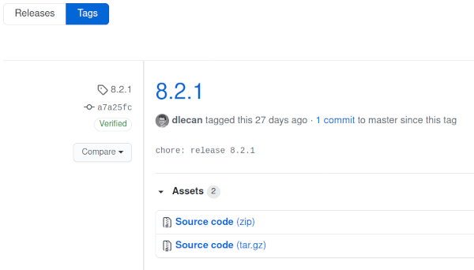
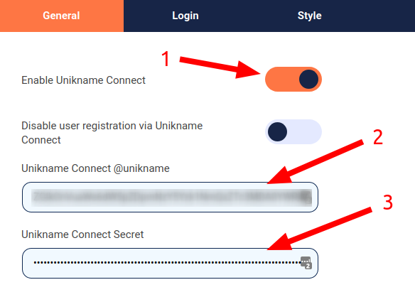
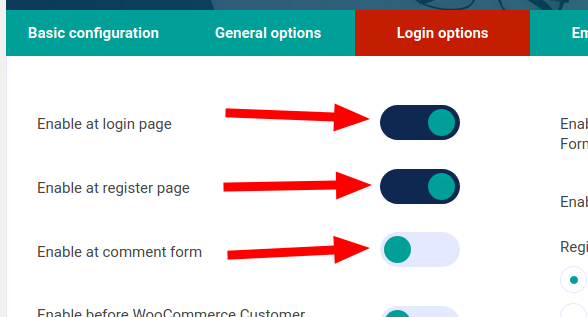
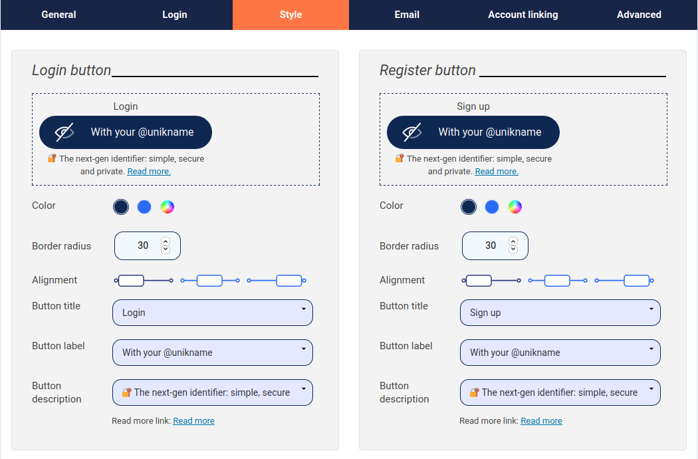

# How to integrate Unikname Connect with WordPress?


<hpicture noshadow></hpicture>

<br/>

<brand name="UNC"/> can be easily integrated with your WordPress website with a simple plugin. [WordPress](https://wordpress.org) is a free and open-source content management system (CMS) written in PHP and paired with a MySQL or MariaDB database.

WordPress is used by more than 60 million websites, it is one of the most popular content management system solutions in use.
WordPress was originally created as a blog-publishing system but has evolved to support other types of web content: corporate website, media galleries, online stores...

:::tip Example
Many WordPress websites are running with Unikname Connect such as [La Bande Du Coin](https://www.demo.labandeducoin.fr/) or  [Cryptomaniac](https://www.cryptomaniac.fr) to give you some examples.

👉 You're welcome to look at them and to see how they've integrated the <brand name="UNC"/> Button.
:::

**Table of content**

[[TOC]]

<hseparator/>

<div id="prerequisites"></div>

:::warning Prerequisites
:heavy_check_mark: You've signed-up for a Unikname-Connect account
<hbox>_See [How to sign-up for a Unikname-Connect account?](./../../howto-signup-unconnect-account)_</hbox>
:heavy_check_mark: You've got and setup the Trust certificate for your website
<hbox>_See [How to get and setup the trust certificate for your website?](./../../howto-get-unikname-trust-certificate-organization)_</hbox>
:heavy_check_mark: During the sign-up process you've received your Unikname-Connect Account ID and your API secret key.

:book: We assume you're familiar with the administration of your WordPress website.
:::

## Step 1. Install the WordPress plugin

Unikname plugin is available **for free** [on the official WordPress plugins repository](https://wordpress.org/plugins/unikname-connect/).

There are various ways of installing the plugin, so choose the one adapted to your installation:

- From your WordPress Dashboard
- With Composer
- From the Github Repository

### Install from your WordPress Dashboard

You can install the plugin directly from your WordPress Dashboard.

1. Go to your WordPress Dashboard
1. Go to the extensions/plugins manager
1. Add a new one
1. Look for `unikname` in the search box on right
1. Install `Unikname` plugin
1. Then `enable` it

### Advanced installation methods

::: details Advanced installation methods
#### Install with Composer

If you're using Composer to manage WordPress, add WordPress-Unikname-Connect to your project's dependencies through the [WordPress Packagist repository](https://wpackagist.org/search?q=unikname).

Run de following command:
```
composer require wpackagist-plugin/unikname-connect
```
#### Install from the Github Repository

##### Stable version of the plugin

1. Go to [the release page of WordPress-Unikname-Connect plugin](https://github.com/unik-name/wordpress-unikname-connect/releases)
1. Choose the version you want to install by clicking on its version. You should select the last one available
1. Select the archive to download which matches your platform ('zip' or 'tar.gz' - choose 'zip' if you don't know)

<hpicture></hpicture>

1. Extract the downloaded ZIP archive
1. Rename the directory `wordpress-unikname-connect-X.Y.Z` (`X.Y.X` depends on the downloaded version) to `wordpress-unikname-connect`
1. Upload the `wordpress-unikname-connect` directory to your `/wp-content/plugins/` WordPress server directory
1. Activate _Unikname Connect_ plugin from your Plugins page

##### Unstable/development version of the plugin

:warning: With this method, you are going to install a **development** version of the plugin, which **might be unstable**.

Install it only to test unreleased features, to check if a bug as been correctly fixed...

1. Download [WordPress-Unikname-Connect plugin](https://github.com/unik-name/wordpress-unikname-connect/archive/master.zip)
1. Extract the downloaded ZIP archive
1. Rename the directory `wordpress-unikname-connect-master` to `wordpress-unikname-connect`
1. Upload the `wordpress-unikname-connect` directory to your `/wp-content/plugins/` WordPress server directory
1. Activate _Unikname Connect_ plugin from your Plugins page

:::

## Step 2. Setup the WordPress Plugin

### General

1. Enable the `Enable Unikname Connect`

Configure the information **provided by the Unikname Support Team (see <a href="#prerequisites">Prerequisites</a>)**:

2. `Unikname-Connect Site Id` with the Unikname Connect site ID
2. `Unikname-Connect Secret` with the Unikname Connect site secret key

<hpicture></hpicture>

### Pages options

You can then configure on which pages of your WordPress site you want to display the Unikname Connect button:

<hpicture></hpicture>

### Unikname Connect buttons style

You can also fine-tune the style options of the Unikname Connect buttons:

<hpicture></hpicture>

**All done!**

New users are now able to use their @unikname ID to sign-up to your Wordpress website.

<hseparator/>

## Troubleshooting

If you’re having issues when connecting (access denied ...), check that the credentials (the @unikname of your organization, Unikname Connect secret, client id/secret ...) you are using to connect to <brand name="UNC"/> authentication server are the good one.

### When connecting, my users are stuck at https://mydomain.com/?OIDCCallback=UniknameConnect&code=...

This situation might have several origins.

#### Wrong plugin configuration

Check again that the credentials you are using to connect to Unikname Connect authentication server are the good one, provided by Unikname Support:
- Unikname Connect site id
- Unikname Connect secret

#### TLS error with fsockopen

Some WordPress administrators have reported weird interactions between our TLS Let's Encrypt certificate and WordPress installations with `fsockopen` on PHP 7.3.

Example of errors you might see in your WordPress `debug.log` file ([if enabled](https://wordpress.org/support/article/debugging-in-wordpress/#wp_debug_log)):

```
SSL operation failed with code 1. OpenSSL Error messages:
error:14094458:SSL routines:ssl3_read_bytes:tlsv1 unrecognized name
stream_socket_client(): Failed to enable crypto
stream_socket_client(): unable to connect to ssl://connect.unikname.com:443 (Unknown error)
```

In this case, you need to install `php-curl` on your server, which works fine.

### Compatibility with WP-Cerber plugin

If you are a user of the feature "Custom login URL" feature of WP-Cerber plugin, you need also to enable the "deferred rendering" option to display the Unikname Connect button within the renamed login page.

See this option in the WP-Cerber plugin settings: [https://wpcerber.com/user-switching-with-wp-cerber/](https://wpcerber.com/user-switching-with-wp-cerber/)
