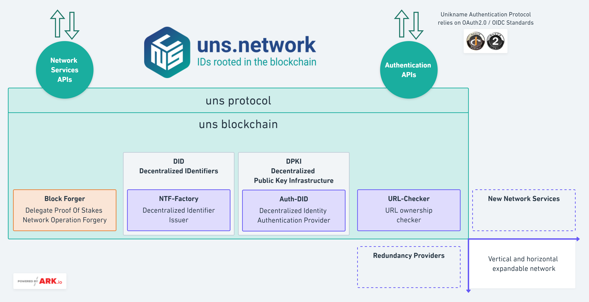

## What is the added value of the blockchain?

Unikname&trade; solutions relies on the ([uns.network](https://www.uns.network/)) decentralized protocol and blockchain technology.

This blockchian is secured by 23 delegates, elected by individual and organization stakeholders. 

This blockchain is specialized in providing dedicated services around Decentralized IDs and Self-Sovereign-Identity (SSID).

This uns.network blockchain is live, [up and running](https://explorer.uns.network/network-monitor) since May 2020. 
