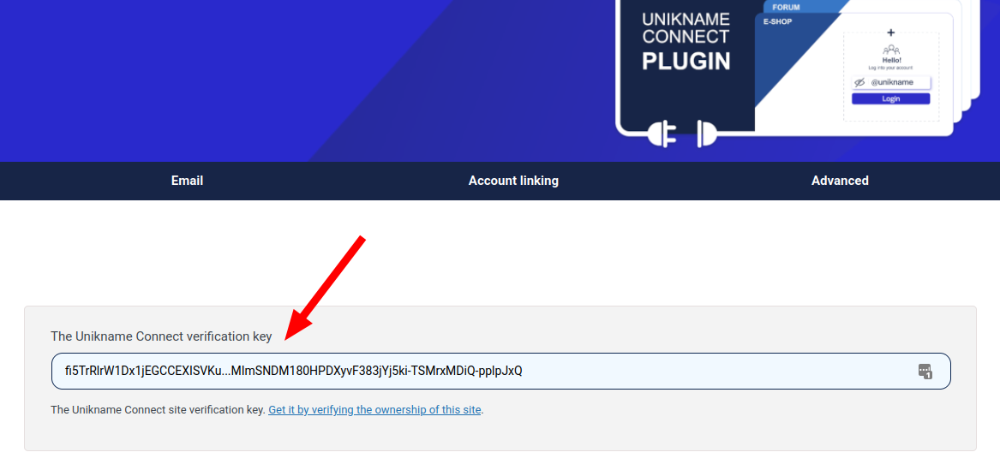

# How to verify the domain or URL of your WordPress website?

If you have configured Unikname Connect with the [Unikname for WordPress plugin](/3-unikname-connect/integration-technology/wordpress/), you may want to prove the ownership of your website.

[Despite there are several methods to validate the domain and thus the URL of your WordPress / WooCommerce website](/3-unikname-connect/howto-create-unikname-trust-certificate-organization.html#step-4-prove-the-ownership-of-your-website), we strongly recommend you to validate it with the simpler "HTML tag" method.

If you want to understand **why** you should verify the URL ot your website, [read more about the Trust Certificate](/3-unikname-connect/howto-create-unikname-trust-certificate-organization.html#trust-appearance).

:::warning Prerequisites
:heavy_check_mark: You've already installed the Command Line Interface tool on your desktop.  
<hbox>_See [How to install the CLI?](/3-unikname-connect/howto-install-uns-cli)_</hbox>
:heavy_check_mark: You are at the Step 4 of the creation of your Trust Certificate
<hbox>_See [How to create and setup the Unikname Trust Certificate for your website?](/3-unikname-connect/howto-create-unikname-trust-certificate-organization.html#step-4-prove-the-ownership-of-your-website)_</hbox>
:::

**Table of Content**

[[TOC]]

## Generate the verification package

Run this CLI command in a terminal:

```bash
uns properties:register "@organization:my-saas-platform-101" --value "www.wordpress-domain.com" 
```
Replace :
- `my-saas-platform-101` by your @unikname of type Organization
- `www.wordpress-domain.com` by the domain of your WordPress website. (without `https://`)

It will output:

```json{5}
{
  "data": {
    ...
    "value": "www.wordpress-domain.com",
    "verificationKey": "fi5TrRlrW1Dx1jEGCCEXISVKu...MImSNDM180HPDXyvF383jYj5ki-TSMrxMDiQ-pplpJxQ",
    ...
  }
}
```

The most important part is the **`verificationKey`**/verification key entry (in the above sample: `fi5TrRl...-pplpJxQ` - without `"`).

You will need to copy/paste later in your clipboard.

## Configure the verification key in your WordPress

The verification of your domain requires to expose the verification key to the crawling of a web bot (such as a search engine bot, but dedicated to Unikname ecosystem).
The best way to do that is to use the dedicated feature provided by the Unikname for WordPress plugin.

After the [installation and the set up of the plugin](/3-unikname-connect/integration-technology/wordpress/#step-1-install-the-wordpress-plugin) in your admin panel, go to "Unikname" &gt; "General"

Add **your own `verificationKey`** (not the one provided as an example)

<hpicture></hpicture>

Don't forget to save the configuration

::: tip Cache plugin
If you have a cache plugin (Divi Rocket, WP Rocket ...), you should clear its cache NOW, before going to the next step.
:::

## Verify the URL/domain of your website

Until done, finish the process by executing the following command with the CLI:

```bash
uns properties:verify "@organization:my-saas-platform-101" --url-channel html
```

Again , replace `my-saas-platform-101` by your @unikname of type Organization.

The command will tell with you its a success or will display an error message you can try to solve by yourself by [reading the troubleshooting section of the reference documentation](/3-unikname-connect/howto-create-unikname-trust-certificate-organization.html#what-to-do-when-it-doesn-t-work).

If the verification is a success, you can safely remove the "Meta Tag Manager" plugin.

**All done!** 

<hseparator/>
