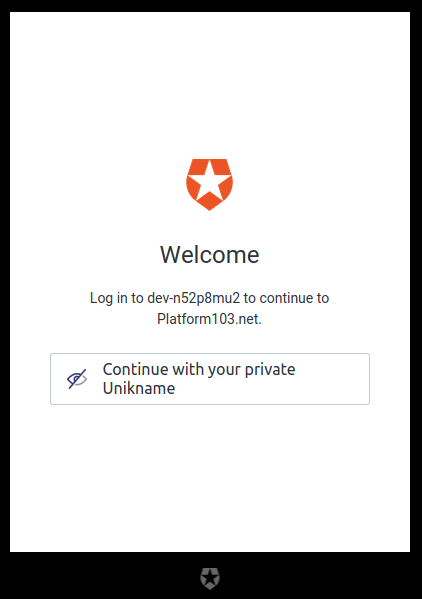

# Integrating of Unikname Connect with Auth0

## About Auth0

[Auth0](https://auth0.com) is a flexible, drop-in solution to add authentication and authorization services to your applications. Your team and organization can avoid the cost, time, and risk that comes with building your own solution to authenticate and authorize users.

You can connect any application (written in any language or on any stack) to Auth0 and define the identity providers you want to use (how you want your users to log in).

[[TOC]]

!!!include(.vuepress/md-templates/unc-registering-process-start.partial.md)!!!

## Example

We are running a live example of integrating Unikname Connect with Auth0, [**platform103.net**](https://www.platform103.net)
This demo website has been coded and setup to sign-in with Automatic Connect.

👉 [Run this example](https://www.platform103.net)

## Configuring your service

If you not have auth0 application yet, please follow the [Get Started](https://auth0.com/docs/quickstarts) Auth0 tutorial to create one.

Once your application is created, you can add an `Enterprise Connection`. Use `Open Id Connect` link.

For <uniknameconnect/> configuration fill those required fields:
- `Connection name`: It's an internal name (Ex: `unikname-connect`)
- `Display name`: Unikname (Will display `Continue with Unikname`, on the connection button)
- `Logo url`: you can add 20x20 <uniknameconnect/> logo image url
- `Issuer URL`: <UncServerUrl/>
- `Client ID`: the client id you have received from Unikname's support request
- `Client Secret`: the client secret you have received from Unikname's support request

## Enable your `Open ID Connect` Connection for your Auth0 application

Go to your application connections list and enable the `unikname-connect` `Open ID Connect` connection.

## Final step

Your customers should now be able to use <uniknameconnect/> to connect to your website, and to see this kind of login screen:

!!!include(.vuepress/md-templates/unc-registering-process-end.partial.md)!!!
