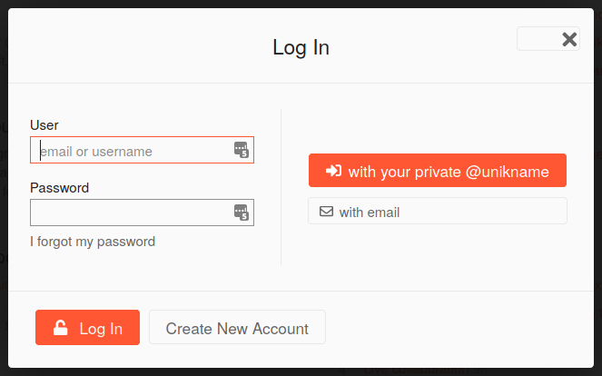

# Integrating Unikname Connect with Discourse

## About Discourse

<uniknameconnect/> can be easily integrated within opensource frameworks compatible with the standard OAuth authorization protocol.

In this example, [our discussion forum website](https://forum.unik-name.com/) is based on the famous open source [Discourse solution)[https://www.discourse.org]. <unikname/> users are automaticaly signed-in for an optimal user experience.

👉 [Run this example](https://forum.unik-name.com/)

[[TOC]]

!!!include(.vuepress/md-templates/unc-registering-process-start.partial.md)!!!

## Requirements
 
- you must have [installed](https://meta.discourse.org/t/install-plugins-in-discourse/19157) the [Unikname Connect plugin](https://github.com/discourse/discourse-openid-connect)
- you must be connected as admin

## Setup

Go to the Discourse "burger" menu → admin → "Settings" tab → "Plugin" category.

You can also go to `https://<your_discourse_forum_url>` `/admin/site_settings/category/plugins`

Then, configure the following attributs:

| Attribut | Description |
|--------|-----------|
| `openid connect enabled`  | Of course, check this box to enable Unikname Connect login for your users |
| `oidc discovery document` | <UncServerUrl/> |
| `oidc client id` | the client id you have received from Unikname's support request |
| `oidc client secret` | the client secret you have received from Unikname's support request |
| `oidc authorize scope` |`openid` |

## Check user login

Your customers should now be able to use <uniknameconnect/> to connect to your website, and to see this kind of login screen:

!!!include(.vuepress/md-templates/unc-registering-process-end.partial.md)!!!
