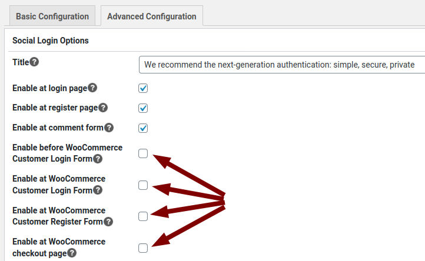

# Integrating Unikname Connect with WordPress and WooCommerce

!!!include(.vuepress/md-templates/unc-registering-process-what-is-unc.md)!!!

## About WordPress and WooCommerce


[WordPress](https://wordpress.org) is a free and open-source content management system (CMS) written in PHP and paired with a MySQL or MariaDB database.

WordPress is used by more than 60 million websites, it is one of the most popular content management system solutions in use.
WordPress was originally created as a blog-publishing system but has evolved to support other types of web content: forums, media galleries, online stores... such as with WooCommerce extension.


[WooCommerce](https://woocommerce.com/) is an open-source e-commerce plugin for WordPress.
It is designed for small to large-sized online merchants using WordPress.

Many WordPress and WooCommerce websites are running with Unikname Connect, such as [La Bande Du Coin](https://www.demo.labandeducoin.fr/), [Cryptomaniac](https://www.cryptomaniac.fr)...

Look at them to see how they are using Unikname Connect to increase their business!

**Table of Content**

[[TOC]]

## WordPress plugin features

- Compatible with WooCommerce templates and features
- Add `Connect with your private @unikname` button in WordPress screens: login, register, comment
- Add `Connect with your private @unikname` button in WooCommerce screens: login, register, checkout

This plugin can also be used without the WooCommerce extension.

!!!include(.vuepress/md-templates/unc-registering-process-start.partial.md)!!!

## WordPress plugin installation

Unikname Connect plugin is available **for free** [on the official WordPress plugins repository](https://wordpress.org/plugins/unikname-connect/).

There are various ways of installing the plugin, so choose the one adapted to your installation:

- From your WordPress Dashboard
- From the Github repository
- With Composer

### From your WordPress dashboard

You can install Unikname Connect from your WordPress Dashboard.

1. Go to your WordPress Dashboard
1. Go to the extensions/plugins manager
1. Add a new one
1. Look for `unikname connect` in the search box on right
1. Install `Unikname Connect` plugin
1. Then `enable` it

### From Github plugin repository

1. Download [WordPress-Unikname-Connect plugin tarball](https://github.com/unik-name/wordpress-unikname-connect/archive/master.zip)
1. Extract the downloaded ZIP archive
1. Upload the `wordpress-unikname-connect-master` directory to your `/wp-content/plugins/` directory (you can remove the trailing `-master` in the name of the directory)
1. Activate WordPress-Unikname-Connect from your Plugins page

### With Composer

If you're using Composer to manage WordPress, add WordPress-Unikname-Connect to your project's dependencies through the [WordPress Packagist repository](https://wpackagist.org/search?q=unikname+connect).

Run:

```
$ composer require wpackagist-plugin/unikname-connect
```

## WordPress configuration

### Basic configuration

1. Enable the `Enable Unikname Connect`
1. Configure `Unikname Connect @unikname` with the information given from Unikname Team Support
1. Configure `Unikname Connect Secret` with the information given from Unikname Team Support


### Advanced configuration

You can also configure some extra parameters in the `Advanced` tab of the plugin, such as displaying the `Unikname Connect` button on WooCommerce pages (see below).



!!!include(.vuepress/md-templates/unc-registering-process-end.partial.md)!!!
