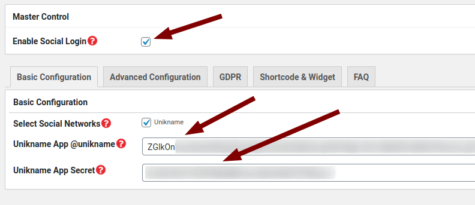

# Integrating Unikname Connect with WordPress

!!!include(.vuepress/md-templates/unc-registering-process-what-is-unc.md)!!!

## About WordPress


[WordPress (WordPress.org)](https://en.wikipedia.org/wiki/WordPress) is a free and open-source content management system (CMS) written in PHP and paired with a MySQL or MariaDB database.

WordPress was originally created as a blog-publishing system but has evolved to support other types of web content including more traditional mailing lists and forums, media galleries, membership sites, learning management systems (LMS) and online stores.
WordPress is used by more than 60 million websites, it is one of the most popular content management system solutions in use.

[[TOC]]

## Examples of integration with Unikname Connect

Many Worpress websites are running with Unikname Connect, such as [La Bande Du Coin](https://www.demo.labandeducoin.fr/), [Cryptomaniac](https://www.cryptomaniac.fr)...
Look at them to see how they are using Unikname Connect to increase their business!

!!!include(.vuepress/md-templates/unc-registering-process-start.partial.md)!!!

## Installation of the plugin

### From your WordPress dashboard

The plugin is not available through WordPress dashboard yes, but it will be soon!

### From Github plugin repository

1. Download [WordPress-Unikname-Connect plugin tarball](https://github.com/unik-name/wordpress-unikname-connect/archive/master.zip)
1. Extract the downloaded ZIP archive
1. Upload the `wordpress-unikname-connect-master` directory to your `/wp-content/plugins/` directory (you can remove the trailing `-master` in the name of the directory)
1. Activate WordPress-Unikname-Connect from your Plugins page

### With Composer

If you're using Composer to manage WordPress, add WordPress-Unikname-Connect to your project's dependencies.
As the plugin is still evoling, you are advice to install the lastest version provided from our [Git repository](https://github.com/unik-name/wordpress-unikname-connect).

Edit your `composer.json` and add:

```json
{
  ...
  "repositories": [
    {
      "type": "vcs",
      "url": "https://github.com/unik-name/wordpress-unikname-connect"
    }
  ],
  ...
}
```

Then, run:

```
$ composer require unikname/unikname-connect dev-master composer
```

Or manually add it to your `composer.json`:

```json
{
  ...
  "require": {
    "unikname/unikname-connect": "dev-master"
  }
  ...
}
```

## Configuring your service

1. Enable the `Enable Social Login`
1. Configure `Unikname App @unikname` with the information given from Unikname Team Support
1. Configure `Unikname App Secret` with the information given from Unikname Team Support



!!!include(.vuepress/md-templates/unc-registering-process-end.partial.md)!!!
